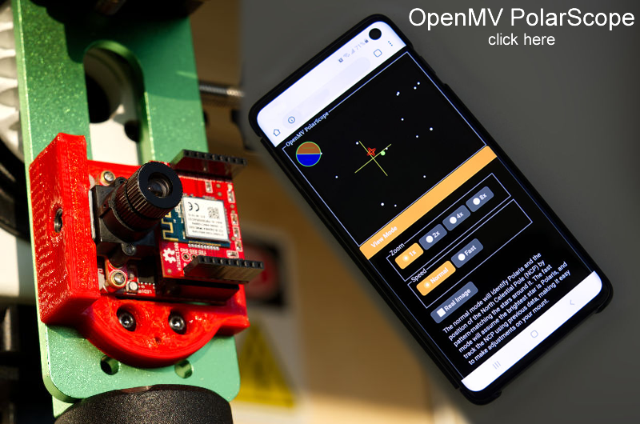
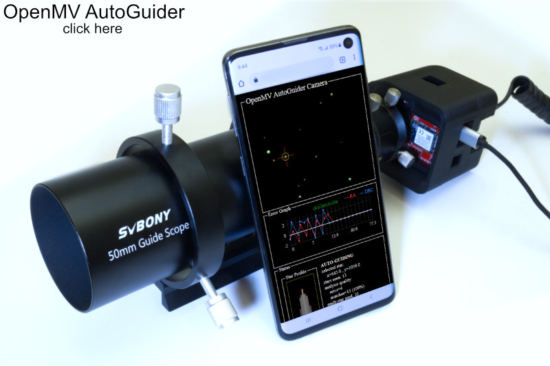

I made a Polar Scope and Autoguider using OpenMV. Both projects utilize OpenMV's embedded image processing algorithms to assist in astrophotography while using WiFi to provide a user interface on any smartphone.

A polar scope is a small telescope used to polar-align star-tracking camera mounts and equatorial telescope mounts. A digital camera version that leverages OpenMV computer vision algorithms can achieve much better accuracy, improving the quality of astro-photographs! With a WiFi connected web UI, it's way more convenient to use.

An autoguider is something that locks onto one star, and commands a computerized telescope mount to move in tiny steps to follow that one star, thus correcting for any errors in the gear train and polar alignment. This prevents blurriness in astrophotographs in extra long exposures.

OpenMV is an open source hardware platform that combines a camera, microcontroller, and image processing algorithms. It can run MicroPython and has accessories such as the WiFi shield. It is a quick and easy way to implement low power embedded vision processing in projects such as self-driving robot racecars.

