# OpenMV-Astrophotography-Gear

Using OpenMV to assist in astrophotography!

I made a Polar Scope using OpenMV

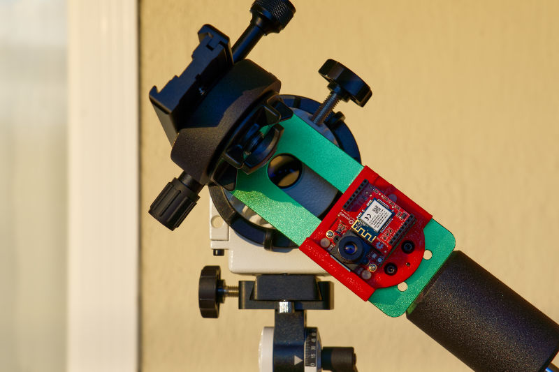
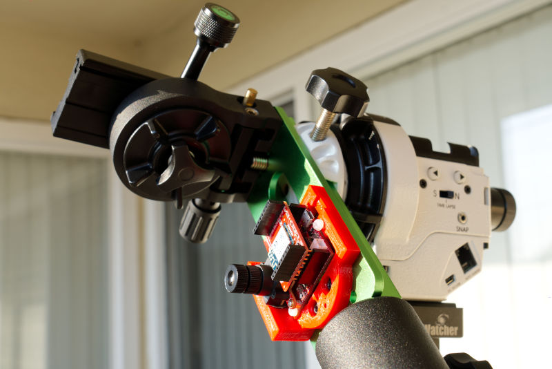

A normal polar scope is used to polar-align star-tracking camera mounts and equatorial telescope mounts. A digital camera version that leverages computer vision algorithms can achieve much better accuracy, improving the quality of astro-photographs!

 * Identifies Polaris, aka The North Star, and computes the position of the North Celestial Pole
 * Shows a crosshair on screen so the user can point it right at the North Celestial Pole

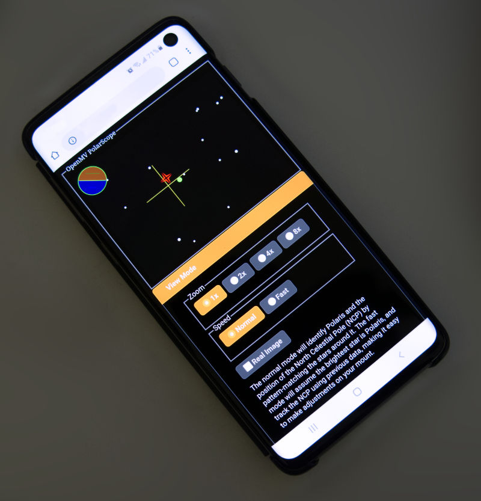

 * Use with any smartphone! Browser based UI, works as a WiFi soft-AP captive portal, no WiFi router required
 * Identifies 500 other stars around Polaris just in case you have trouble finding Polaris

 * Accounts for current time and location to compensate for atmospheric refraction
 * All open source, [OpenMV](https://openmv.io/) is an open source embedded computer vision platform, used frequently for things like self-driving robot cars. My code is written in C, MicroPython, JavaScript, plus some HTML and CSS

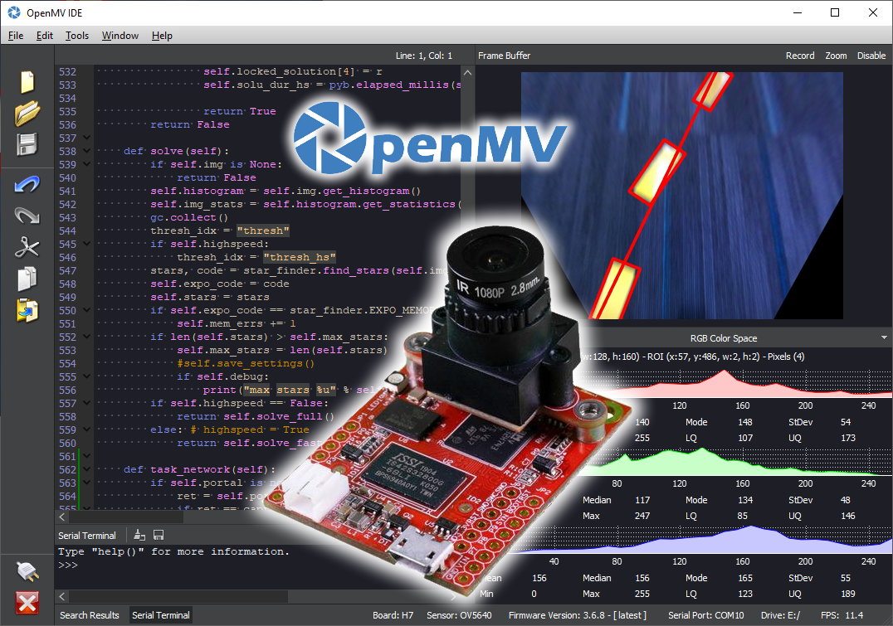

**Currently this project is feature-complete, but requires outdoor testing.**

[click here for the instructions document](Instructions.md)

The journey it took to complete this project was quite the special learning experience. This is the story about what happens when a bird photographer with a EE degree gets lost and finds a telescope store.

I hope you all had a chance to see [Comet NEOWISE](https://en.wikipedia.org/wiki/C/2020_F3_(NEOWISE)). It was discovered on March 27, 2020, and in July 2020, it started to become visible a few hours before dawn. It's a happy coincidence that I've spent the pandemic getting into photography, so up a hill I went with a bit of gear to see the comet at 3AM. I got this shot

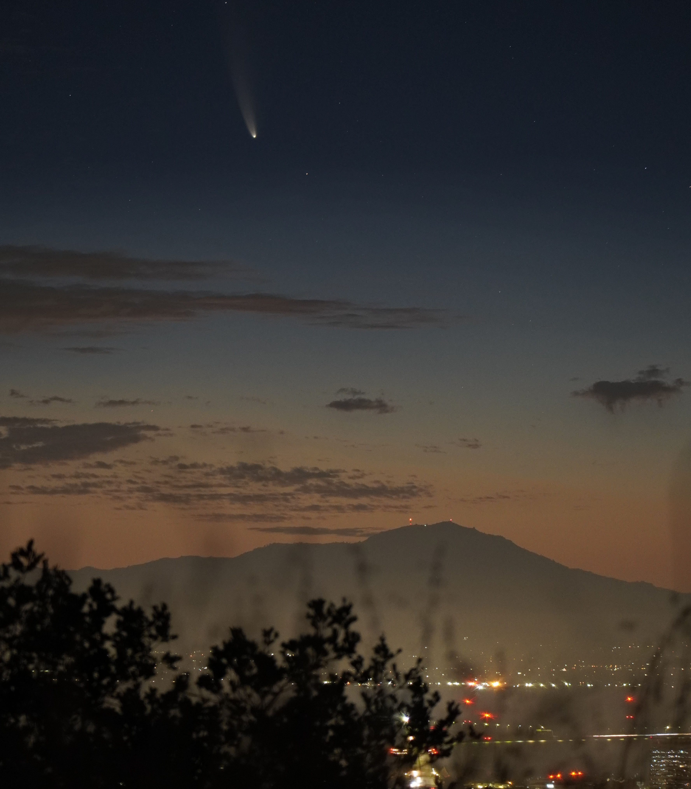

I'm quite proud of it and can claim that it's my first ever astro-photograph.

Nah... that's a lie. I probably deleted like 50 pictures before that one. I had no idea what I was doing... I spent the entire time experimenting with different camera exposure settings and compositions before deciding that one was the best. I thought I can use long shutter speeds let in more light, to get great low noise pictures in the dark. The only problem is that if the camera moves, then the picture will be blurry. That's a problem easily solved by holding my camera with a tripod.

So I gave it a shot... 5 second shutter speed...

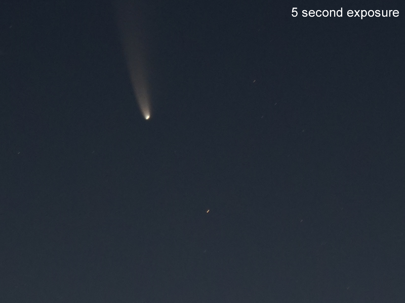

Why is the star not round?! The sky moves!

It moves pretty fast!

Here's an illustration of what the stars look like, zoomed in, with different shutter speeds:

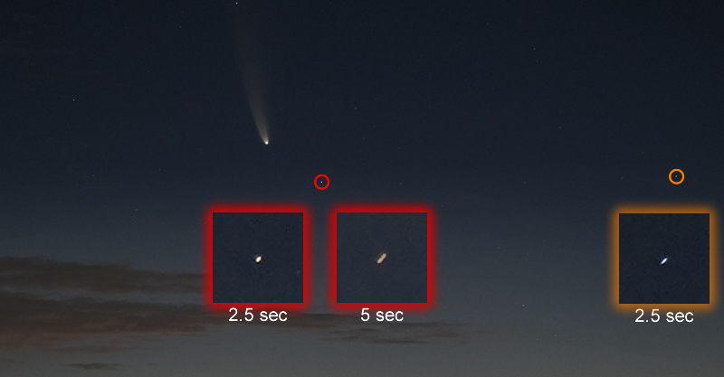

The above illustration shows that the same star will move twice as much with twice as much shutter time. It also shows that the star on the right, in the orange circle, moves faster than the star in the red circle.

This is because the Earth is spinning. The stars in the sky, like our own beloved Sun, rises in the East and sets in the West exactly once a day. So if you took a picture with several hours worth of exposure...

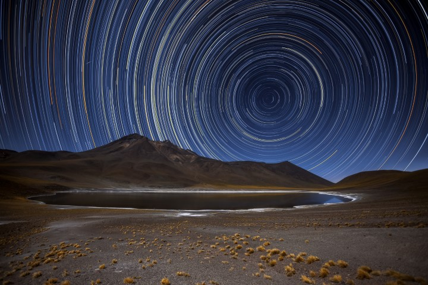

(credit: [https://en.wikipedia.org/wiki/Star_trail#/media/File:All_In_A_Spin_Star_trail.jpg](https://en.wikipedia.org/wiki/Star_trail#/media/File:All_In_A_Spin_Star_trail.jpg) I wish I was that good, still working on it...)

Oops, I lied again, did I really say "exactly once a day"? The **24 hours** that make up an entire day, that's a **Solar Day**, because it's how long it takes the Sun to circle the Earth exactly once. Ahhhh but the Earth also orbits the Sun! The Earth does not orbit any one of the other billions of stars, and those stars **appear** to circle the Earth exactly once every **23 hours, 56 minutes, and 4.0905 seconds**. This is called a **Sidereal Day**.

What can hold the sky still for me? It turns out asking Atlas to stay a bit more still is a bit out of my budget... But humans have managed to land on the Moon, and I can buy a motor that spins my camera around slowly exactly once every sidereal day for about $300

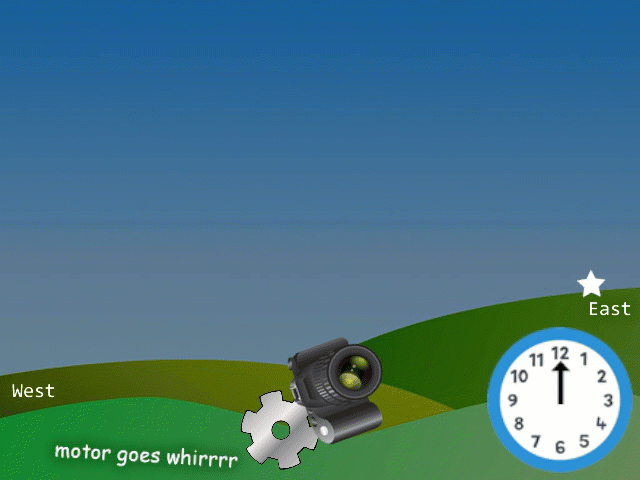

(sooooo it looks like there's no official name for these devices, people just call them camera mounts, so I'll call them star-tracking camera mounts. I would like to call them star-trackers but that's a different device used for navigation)

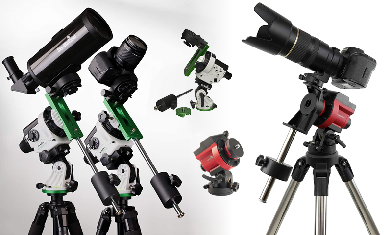

You mount a camera on it and it will follow the stars. This allows astrophotographers to extend their shutter to tens, or even hundreds of seconds, without getting any star-trails in their picture. If you've ever used a equatorial telescope mount, it's the same thing but with a motorized right-ascension axis, and no declination axis.

These tracking mounts, and all equatorial telescope mounts, computerized or not, all require the user to do a **polar-alignment** when setting up for the night. Basically, you gotta point the motor's rotation axis at **The North Star (Polaris)**...

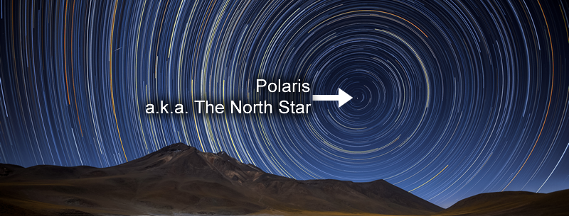

...so that the motor's rotation follows the star's rotation. If this alignment is not correct, the photos you take will still have trails, and even computerized telescopes would not be able to find its target. Since this is a requirement, mounts and trackers usually have something to help the user achieve polar-alignment.

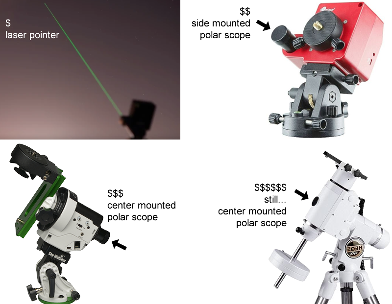

Most of these trackers or mounts come with something called a **polar-scope**.

Polar-Scope
===========

A mini-telescope with a crosshair that you point at Polaris.

Sorry again. You don't point it exactly at Polaris. The Earth rotates about an axis, and this axis defines the North and South pole. We want our motor to rotate exactly in parallel with this axis. It's simply a coincidence that Polaris is soooo very close to the North-pole-of-the-sky that our great ancestors nicknamed it The North Star.

The polar-scope doesn't just have a crosshair, it has a special circle reticle that requires you to take into account the current date, time, and location.

You have to calculate the current sidereal time and adjust for your location's longitude to figure out where Polaris should be on the reticle circle.

Astronomy is an activity spanning centuries, these types of mounts existed before digital cameras existed. Today, we have smartphone apps that can help us these calculations. Doesn't sound so bad... It can't be that hard...

I thought so until I tried using one. My biggest gripe with the polar-scope is that it has poor (to be fair, it's "economical") optical design, the reticle will move around the target as your eyes moves around, this is called the **parallax effect**. Ideally, the reticle should stay on target no matter where your eye is.

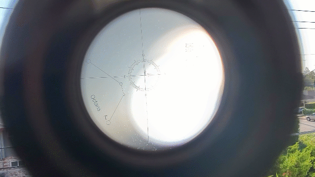

(by the way, the grain you see inside the scope is not dust, it's actually just crappy glass, maybe it's not even glass)

Rifle scopes don't have this problem, the crosshairs of a rifle scope would stay on target no matter where your eye is. But a good rifle scope would cost as much as just one of these mounts, as it requires many more lenses.

When I encountered the parallax effect in my polar-scope, I asked the internet community if it was a defective scope. I complained that it's not possible to be accurate if it has a parallax effect of the reticle. People told me that it's supposed to be simply "good enough" for wide angle astrophotography, and telescope users can just nudge their telescopes. If I really wanted high precision, there are digital cameras that can help me polar-align. You attach the camera to your mount/tracker, calibrate it, point it roughly at Polaris, and they'll tell you how to adjust your mount to achieve polar-alignment.

I researched into these cameras. There are two popular ones on the market right now.

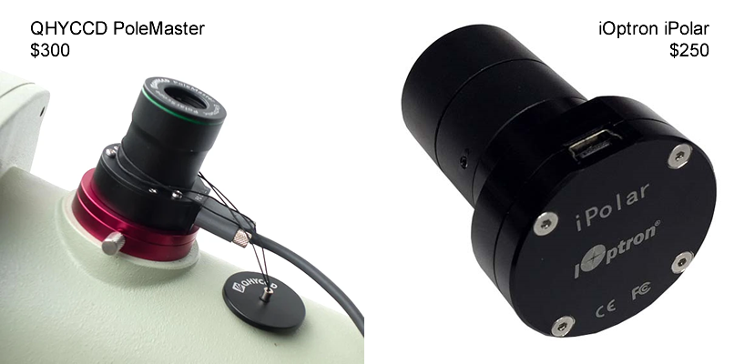

I studied them, watched some videos about how they are used. The user experience for the PoleMaster is just embarrassing, it requires the user to select the stars around Polaris manually. The iPolar at least uses some plate-solving (algorithm to identify stars) to automate that process. My biggest gripe with both of these cameras is that they require you to haul around a laptop to run the software.

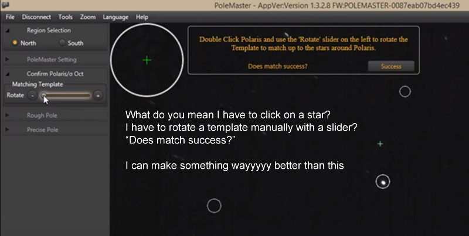

At this point, I decided that they are over-priced for a glorified USB webcam with a CCTV lens, and I can make a better device myself.

The journey begins! The birth of a DIY polar alignment digital camera.

So I put on my product designer hat. My minimum-viable-product needs to:

 * identify Polaris
 * calculate where the North Celestial Pole is
   * using the position of Polaris, the surrounding stars, and other data
 * tell the user how to adjust the mount to achieve polar-alignment

How do I start?

Picking Hardware
================

A Raspberry Pi seems like a solid starting point for any DIY camera project, especially now that they have a "high quality" camera that accepts CCTV lenses. It would get a bit bulky and pricey once you add in things like a case, battery pack, and a screen.

I have previously played with a ESP32-CAM, which would have a OV2640 along with WiFi capability for under $10. But the sensor, simply put, sucks. And the library available simply isn't ready for any advanced control of the camera or any image processing at all. The ESP32-CAM would be great for a dirt cheap WiFi camera project and such but not for this project.

I finally settled on OpenMV.

I first saw it in action when my friend invited me to a robo-car race, and his robot car used one to follow the race track. It's a microcontroller and camera module that can run MicroPython and has MicroPython libraries for image processing similar to OpenCV. The H7 Plus version has a 5 megapixel sensor plus extra RAM. After adding a WiFi module and an appropriate lens, the total cost was only $110. It's all open source so I can optimize cost later. (OpenMV offers a LCD module too but it's not a touch screen, so I decided on WiFi instead)

Since adding a LCD screen isn't as practical as I'd hoped, my product designer hat is making me decide to use WiFi to serve an interactive web-page, the user will use their smartphone as the display and user input.

Switching from product manager to project manager mode... Milestone number 1: take picture of stars, figure out camera settings.

The very first problem I had to tackle was that the shutter speed of the camera sensor was capped at 500ms. With the tiny lens, I needed something longer. Turns out, the camera sensor's MicroPython library has some direct raw register writing functions, and to make the whole camera slower, I can just mess around with the PLL settings, slowing down its clock. I managed to push the maximum shutter time to about 1.5 seconds (some PLL settings would not achieve a lock, some of them are temperature sensitive too).

After solving that, I took a picture with it from my apartment balcony

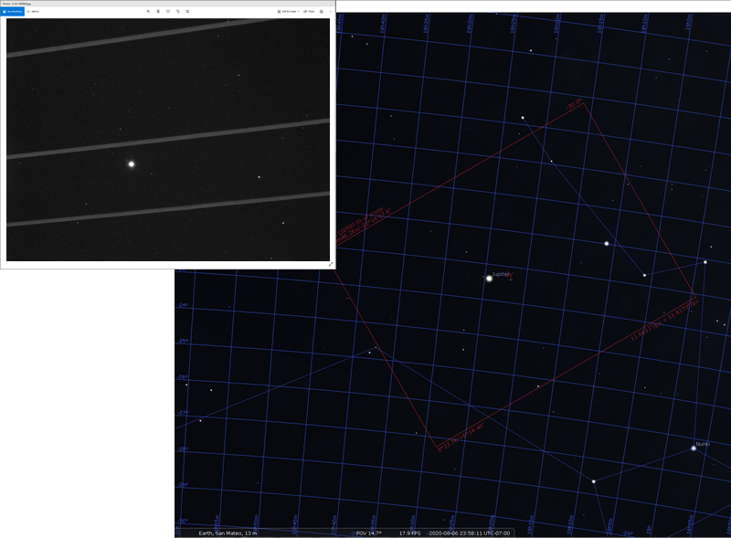

This impressed me, the camera managed to see Jupiter along with its moons! I can work with this.

(The software on the right side is Stellarium. You can input your camera's specifications and it will be able to preview your camera's view of the sky.)

I then went out and took a few pictures of Polaris, testing out various settings in two different levels of light pollution.

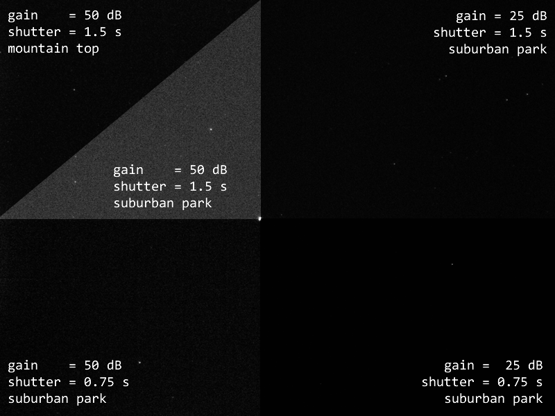

Great, this gave me hope for the image processing algorithm. The plan is to use the `find_blobs()` function, which requires some thresholds. I can use `get_histogram()` and `get_statistics()` to determine a baseline threshold, and warn the user if the light pollution is too strong.

From the test images, I am able to correlate distance between the stars with distance in pixel units. This is important for my plate-solving algorithm.

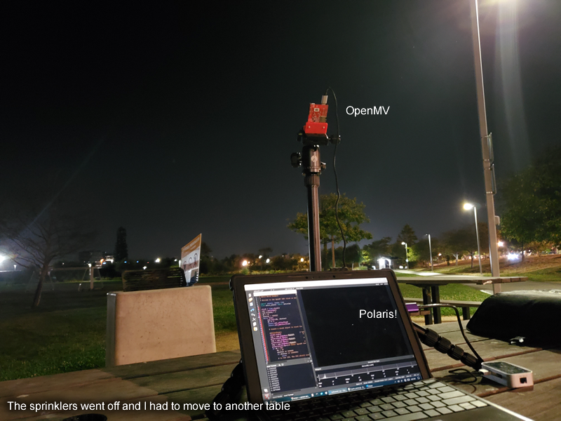

Celestial Coordinate
====================

Just some background knowledge for those readers who are unfamiliar with astronomy.

The position of a star is described with two numbers: Right-Ascension (R.A.) and Declination (Dec.). They are kind of like longitude and latitude for geographic location coordinates. Declination is basically exactly the same as latitude. Right-Ascension is defined as being a circle totalling 24 hours, not 360° like longitude. Also, longitude starts at Greenwich, but right-ascension's zero starts from something called Vernal Equinox.

This is the kind of data a star catalog would give you, the RA and Dec of each star. Importantly, that data is where the stars are on January 1st, 2000. The catalogues might also contain the star's position on the current day.

You might be wondering... why are the positions different between dates? The answer is that the Earth's axis of rotation is actually slowly wobbling. We'll get to what problem this wobble causes this project.

North Celestial Pole Calculation
================================

Mathematically, these coordinates are very easy to work with. Remember how Polaris isn't exactly at the North Celestial Pole? To calculate where Polaris relative to the North Celestial Pole from a certain location on Earth, you simply take the R.A. of Polaris, apply an offset according to the current sidereal time, and then apply another offset according to your longitude (after converting degrees to hours). That would get you the angle of the vector, and the magnitude of the vector is simply 90 subtracting the declination of Polaris. This distance describes an arc in degrees but that's easily converted into pixel units for my camera.

If look through a manual polar-scope, notice how the circle is marked by 12 hours (it's absolutely stupid that they used 12 hours instead of 24)

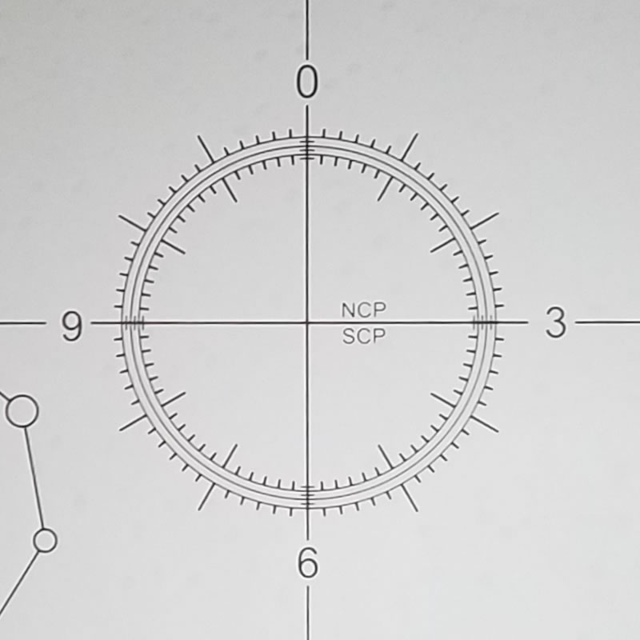

You convert your vector angle into those hours, and place Polaris on the circle where the corresponding tick is.

Notice that there are three circles, the diameters of those three are different. You pick which circle to use according to the current year.

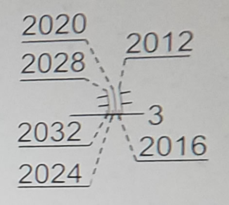

This is how to compensate for the wobble of the Earth's rotation axis.

These are the kind of mathematics that my firmware will need to perform. It's not hard but it definitely took some time to learn the required knowledge before getting it right. In the end, Stellarium was used to verify the output of my calculations.

(By the way, that reticle isn't actually visible at night, but the scope is supplied with a separate LED flashlight that you can shine into it. More expensive mounts would have this light built-in.)

Since we are using computer code, the MicroPython time library uses seconds-since-epoch, with 00:00 Jan 1 2000 (all the times mentioned are UTC +0) being the epoch. That's still usually a huge number that could hurt precision when floating point numbers are involved. So I came up with a new epoch, closer to the current date, which is 20:40:53 of Aug 10 2020. At this moment, if you looked at Polaris from Greenwich UK (0° longitude), Polaris would be at where the star catalog says it's at without any RA offsets. Using this point as my epoch made calculations much easier and more precise.

All calculations have been verified up to the year 2040, just to make sure that floating point precision is good enough.

Read more in depth about the calculations on [this separate page](doc/Calculations-for-Polaris.md)

[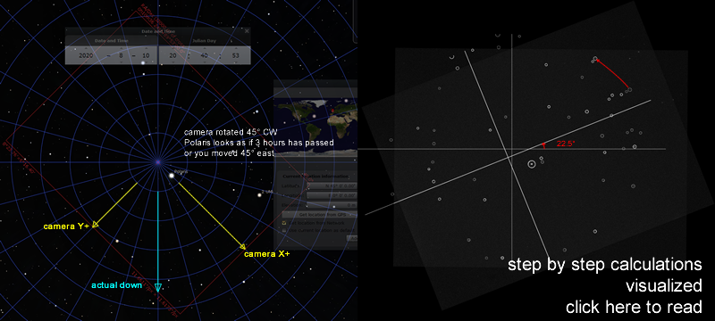](doc/Calculations-for-Polaris.md)

Plate Solving
=============

Plate-solving, "finding match between the imaged stars and a star catalogue", is actually quite complicated. In fact, most open source plate-solvers are simply an API that uploads to [nova.astrometry.net](https://nova.astrometry.net) and download the result, and that obviously requires an internet connection (good dark skies and phone signals don't usually mix), and takes up to 10 minutes for just one camera frame. My own plate-solving algorithm will need to be optimized for my weak hardware and specific use case. This algorithm is described on a separate page where I show you real calculations and visualize what the code is actually doing!

[Read it HERE!](doc/Main-Algorithm-Development.md)

Center Calibration
==================

There will be a crosshair drawn on the image, and the user has to adjust the mount in a way that moves the crosshair towards the North Celestial Pole on the image. Easy peasy, right? Nope... next problem: the camera's axis isn't exactly aligned with the motor's rotation axis, so I can't just draw a crosshair dead center on the image. Where do I draw this crosshair?

All polar-scopes have a calibration routine, and so do the PoleMaster and iPolar. The calibration routine for a manual polar-scope is to point it at something, spin the scope slightly, check if it's still pointed at the same thing, turn some tiny screws if it's not. The PoleMaster makes you click a star on the screen, then spin the camera, then find the same star, and repeat this 2 or 3 times.

I can do better. The goal is to determine the center-of-rotation in the camera view. The data available is the position of Polaris and the North Celestial Pole. When you rotate the image about a point-of-rotation, to find that point-of-rotation:
 1. connect the point-before and point-after by a line, this means you end up with 2 lines
 2. find the mid-points of the two lines from the previous step
 3. draw infinitely-long lines that cross those mid-points perpendicularly to those previous 2 lines
 4. the center-of-rotation is where the two infinitely-long intersect

To visualize, here's a diagram of a triangle rotated about a point (point marked X).

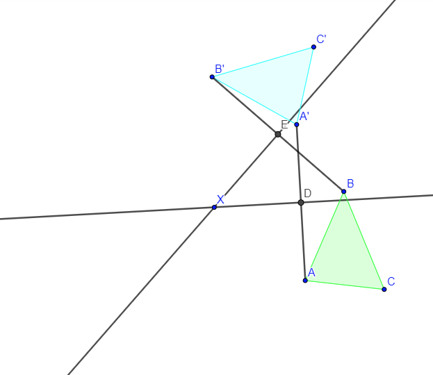

In the above illustration, lines AA' and BB' is step 1, points E and D are step 2, lines meeting E and D are the infinitely-long lines from step 3, and point X is the center-of-rotation found in step 4. This isn't too hard to code, but due to how floating point number work on a computer, the equation yields more accurate coordinates when the rotation is 90°. Perfectly parallel lines would have resulted in a division-by-zero error.

Here it is in action on the screen:

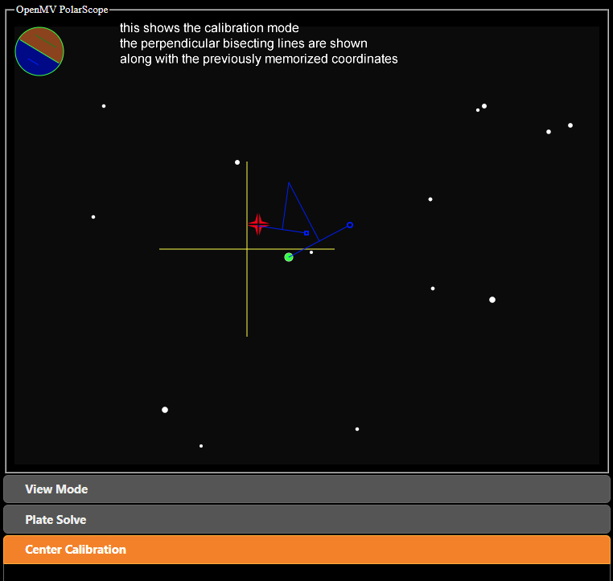

When the user accepts the new location, the yellow crosshair will move to where the blue lines intersect.

There is a secondary calibration mode that uses multiple points. When more points are registered, a circle-of-best-fit is calculated, and the center of the circle can be used as the new calibrated crosshair.

Axis Wobble
===========

I've mentioned before that the Earth's rotation axis wobbles very slowly. One way of visualizing this is to simply watch what happens when you speed up time in Stellarium

To predict the new celestial coordinate of Polaris for a given date:
 1. take its coordinates on Jan 1 2000 and convert it to cartesian coordinates
 2. take its coordinates on Jan 1 2020 and convert it to cartesian coordinates. This is 7305 solar days later.
 3. find dx and dy between the two cartesian positions from the two previous steps
 4. dividing dx and dy by 7305 will give you a movement speed in per-solar-day units
 5. using the movement-per-day, you can predict the new cartesian coordnate of Polaris for any day. You can use Jan 1 2020 as a reference day
 6. convert the new predicted cartesian coordinates back into celestial coordinates

Noteice that there's no reason to use sidereal time units for this calculation. You can, but it offers no advantages and only adds a few extra unnecessary date conversions. However, you do need to understand the Julian Day Number and how to calculate time spans while accounting for leap-years. I used the math formula from [http://www.cs.utsa.edu/~cs1063/projects/Spring2011/Project1/jdn-explanation.html](http://www.cs.utsa.edu/~cs1063/projects/Spring2011/Project1/jdn-explanation.html) in my code.

Unit testing my code and comparing against Stellarium, it showed that for the year 2024, the results were accurate to within 1 arc-second for declination, and 12 arc-minutes for RA. This is excellent because it's less than a pixel worth of error.

Atmospheric Refraction
======================

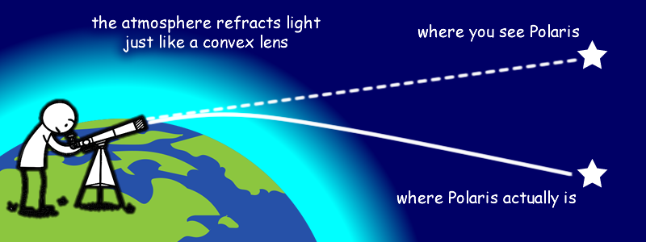

Atmospheric refraction is a small problem that ordinary polar-scopes cannot help overcome. The amount of refraction that you will encounter depends on your latitude, air pressure, and air temperature. Although the light will be taking a very complex path through many layers of the atmosphere, generally, the amount of refraction can be estimated by the following math formula:

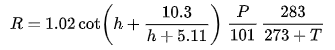

(from [Wikipedia](https://en.wikipedia.org/wiki/Atmospheric_refraction), according to the Wikipedia page, this approximation formula is good enough for astronomy and navigation)

Where "h" is the altitude in degrees (for looking at Polaris, this is equal to your latitude), "R" is the result in arc-minutes. "P" is the pressure in kPa and "T" is the temperature in Celsius degrees. "cot" is the cotangent function (the reciprocal of the tangent function).

All of this is simple enough to code. At the North Pole, the result is very close to zero, because looking straight up, you wouldn't experience any refraction. Near the Earth's equator, the refraction could be over 30 arc-minutes, which would be over 100 pixels on the camera's image. This calculation can make tropical astrophotographers very happy, while people in Alaska might not bother using it.

The hardest part about coding all this is actually trying to judge which way is "down", since the camera isn't necessarily upright. Luckily, the plate-solving algorithm knows how the other stars are rotated around Polaris, and the current date and location can be used to apply another rotation offset, giving me an angle of the horizon. Thus, I can figure out which way is down.

Software and Firmware Engineering
=================================

I already mentioned the shutter speed hack. There are plenty more challenges that I've faced and have overcome.

This project was programmed with a mix of C, Python, JavaScript, and HTML. Since I've decided to use the WiFi module to serve up a web page to be viewed by a smartphone, I could balance the workload between the OpenMV and the web browser of the smartphone. In the end, the OpenMV handled the image capture, image processing (`find_blobs()` and such), the plate-solving, and implements a small HTTP server. That data from the image processing and plate-solving is passed to the web browser as JSON objects. Passing JPG images is also possible but slow (we'll get to that problem later). The web page UI is responsible for displaying the data onto a SVG canvas, and handling UI/UX elements such as inputs for the current location, camera exposure settings, calibration procedure, etc.

Where does C come in? OpenMV has a flash memory file system (and a microSD card slot), you can put plain text MicroPython code in it to be run. The microcontroller itself has the MicroPython interpreter plus all of the image processing algorithms and hardware driver code, which are written in C. Things that are written in C are compiled, not interpreted, so they run faster. All of this is open source, so I can make modifications to the C code if I need to. If you mess with the C code, you do risk bricking the board, but it is easy to recover. It is also much harder for OpenMV's creator to offer you help if you mess with the internal stuff he wrote.

The first two huge annoyances that I had to deal with:

 * using a single thread to serve HTTP requests caused problems when a loaded HTML page triggers multiple other HTTP requests to retrieve JS and CSS files
   * solution is to pack all the JS and CSS files right into the HTML page, and code in a way such that only one HTTP request is active at a time
   * the packing is automated through the MicroPython code, it looks for the `</title>` HTML tag, and squeezes in the required files there, then it stops looking to speed up the transfer
   * I did attempt to load JS files one at a time using some JS, this worked on desktop browsers but did not work on mobile browsers
 * capturing a frame with the camera is a blocking call, which makes the HTTP server not able to respond quickly
   * I dug into the OpenMV back-end firmware and added a non-blocking way of capturing frames. This change was then submitted back to the original GitHub project as a pull-request.

Then as development and testing went further on, I ran into a out-of-memory issue. It seems like there was a limit to how many blobs can be detected by `find_blobs()` before it runs out of memory and throws an exception. To fix this, I dug into the firmware back-end again. First, I removed many properties from the blob data structure so that it consumes less memory. Second, I added a way for the `find_blobs()` to reject blobs that are too big (it already rejects blobs that are too small).

The web interface originally utilized AJAX requests to communicate with the MicroPython server. This method had some reliability issues, seems like occasionally, AJAX requests would simply fail and the OpenMV never receives it. Of course, it will reattempt the request, but it seems like once one request is lost, all subsequent requests are lost. It seemed like the WiFi module had issues managing old and new sockets. The first fix I attempted was to add server-side timeouts that cleared all open sockets, and if that timeout failed, it would reset the whole WiFi module. But the final solution was to rewrite both the front-end and back-end using WebSockets instead of AJAX, which meant only one socket is needed, and the user experience became much more reliable.

Streaming live JPG images is a requirement because the camera may need to have its focus adjusted. It would also help with the exposure adjustments. But the data size could be huge and the transfer rate is slow. Also, AJAX cannot be used to transport binary JPG data. Base64 encoded data could be transported by AJAX but since it makes the data even longer, it was not fast enough. In the end, at 1x zoom, the image is first shrunk by half and compressed before transmission. At other zoom levels, the image is cropped instead of shrunk. The resulting responsiveness is enough.

(that video shows how it works but it's slower in real life as the shutter speed needs to be much slower)

Since I didn't want to rely on the browser for local storage, when the user wants to save a setting, it's sent back to the HTTP server. The server will save it as a JSON file in the OpenMV's flash memory.

The UI used a lot of [jQuery UI](https://jqueryui.com/), which made great looking and easy to use UI elements on mobile browsers. I had to hack the theme CSS to keep only the checkbox tick image to lighten up the payload.

The WiFi module can operate in soft-access-point mode, so you do not need a WiFi router with you. In this mode, it starts a micro DNS server that redirects all DNS name resolutions to itself. This creates a captive portal, think of the Star Bucks WiFi login page. This means the page cannot be secured by SSL, as technically I've hijacked the connection and the whole point of SSL is to prevent hijacking. Not using SSL means I can't directly access the smartphone's GPS data through the web browser ("OpenMV wants to know your location, allow?"). The location coordinates needs to be entered in by the user manually. Bummer. I included the [Magellan JS library](http://dbarbalato.github.io/magellan/) to help parse GPS coordinates.

More Plate Solving
==================

I wanted another feature: identify other stars that are not Polaris. This would help people if they get "lost". If people can identify what they are pointed at, they can use additional smartphone apps to help navigate towards Polaris.

This was a big endeavour on its own. [Read about it here](doc/Extra-Plate-Solving-Algorithm.md).

[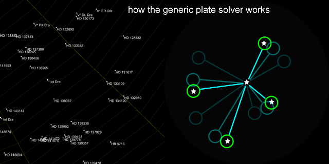](doc/Extra-Plate-Solving-Algorithm.md)

Hot Pixels
==========

When the weather got hot, I faced a new problem. The camera started seeing stars that didn't move even when I moved the camera. I was puzzled until I realized that the sensor is getting hot and seeing hot-pixels.

The simple solution is to just add a button that makes the device remember where the hot pixels are. They can be removed from the image later. In my implementation, the hot pixels are still used during the image processing, but if the pixel is not a part of a pattern match, then it is removed from the visible image.

3D Printed Base Plate
=====================

To be able to attach the OpenMV to an equatorial mount or tracker, I designed a 3D printed plate that holds it.

It has hole patterns that matches the QHYCCD PoleMaster. QHYCCD offers a variety of adapters for various mounts and trackers so it's an easy way for me to start

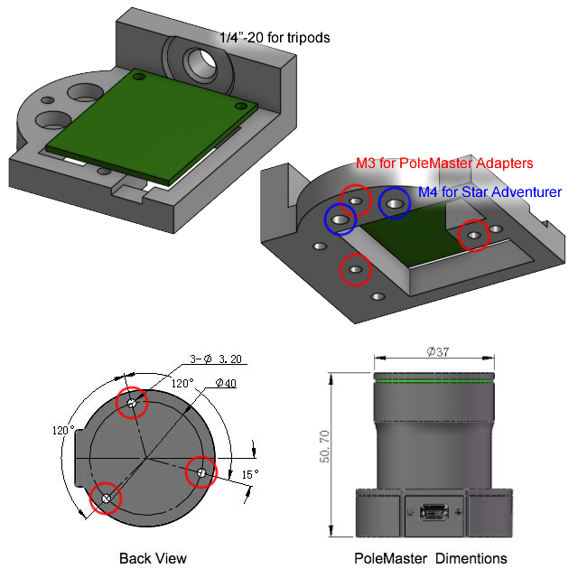

 My 3D print also has a large 1/4"-20 threaded insert for tripods, and another two 4mm holes specifically for use with the Sky-Watcher Star Adventurer that I own.

The 3D model is open source, publicly hosted on OnShape and ready for export: [https://cad.onshape.com/documents/c9071d...a6bfdc](https://cad.onshape.com/documents/c9071d5019e566707bd722e9/w/00d826b3890ec75dd7440bb9/e/b73a27c8ab1a7c58eba6bfdc). If you want to make changes, simply fork it to your own OnShape account.

The remaining mechanical problems are about cooling the camera sensor, and preventing damage from potential water drops. The OpenMV board itself does not make it easy for me to solve either of these problems, but luckily, it's open source!

Results
=======

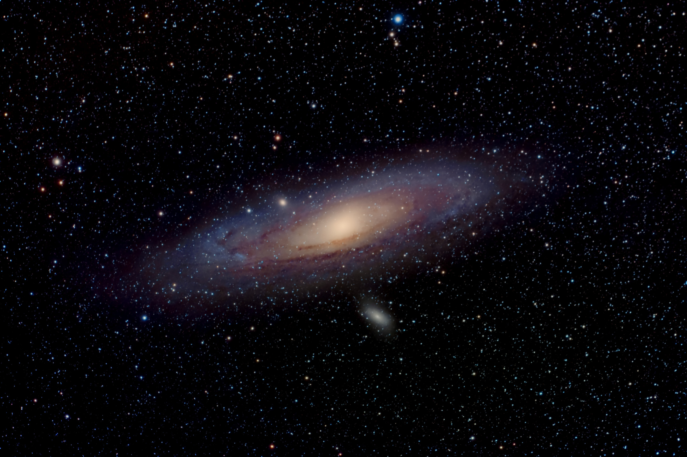

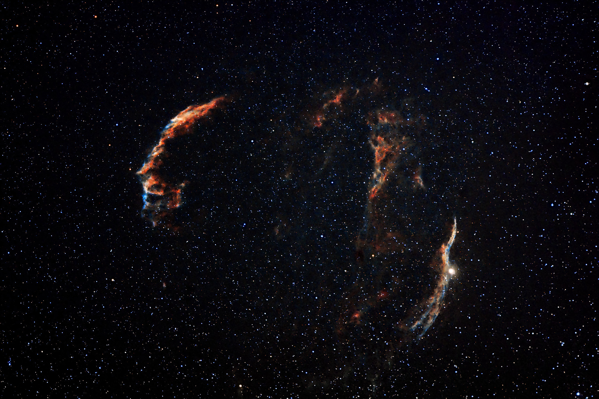

Those are my first two deep sky astrophotographers. The specs of these photos:

 * Sony a6000 camera, 20 megapixels, APS-C sensor, IR-UV filter removed (aka. astro-modified sensor)
 * RedCat 51 telescope, 250mm focal length, 51mm objective diameter
 * A bit over 3 hours total integration time for each photograph
   * up to 120 seconds per exposure but 30 seconds during wind
 * Sky-Watcher Star Adventurer tracking camera mount, running at 8V (normally it uses USB 5V or 6V from AA batteries)
 * Optlong L-Pro filter was used for the Veil Nebula photo
 * Stacking and editing with
   * Siril: stacking, background calibration, colour balancing
   * Starnet++: a machine learning neural network to remove stars from the nebula (I edited the nebula and stars separately, then merged them back together)
   * Affinity Photo: for everything else
   * I still need practice editing, most people will not like how I oversaturate the colours to an unrealistic degree

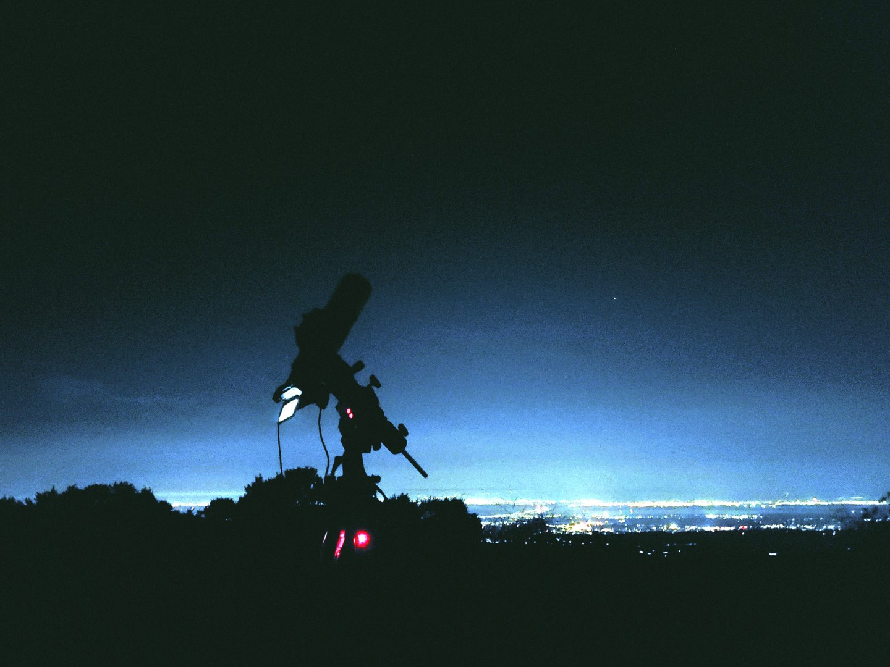

To illustrate how well the tracking worked (which shows how well it was polar-aligned):

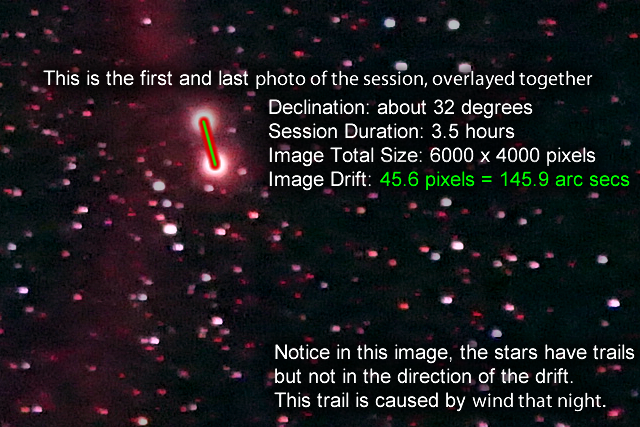

To illustrate other kind of errors you may encounter:

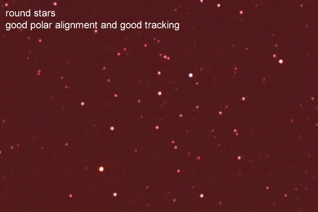
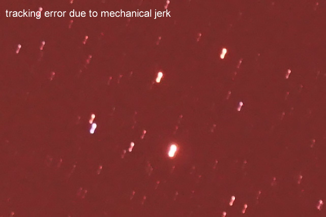
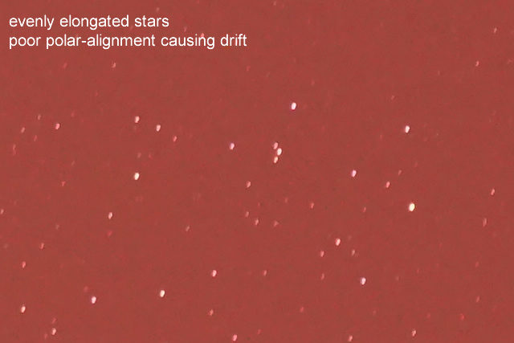

Future Improvements
===================

The equivalent focal-length lens for a CS lens mount would have about twice the aperture as the current M12 lens. If I add a CS lens mount, the I can almost double the framerate.

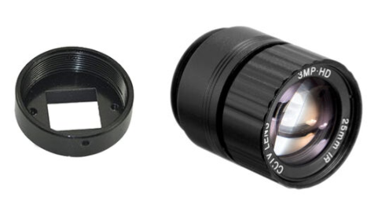

This would add another $40 to the cost.

After extensive testing, I don't think the extra framerate will be worth the cost.

Maybe I can figure out a way to cool the camera sensor. I can get a $10 extension cable made specifically for OpenMV

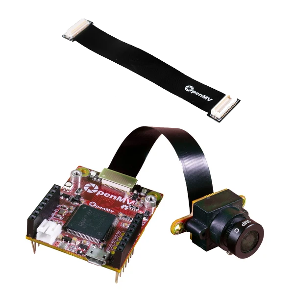

and then figure out how to mount a heatsink and maybe a fan.

Next Project
============

An auto-guiding camera is something that locks onto one star, and commands a computerized telescope mount to move in tiny steps to follow that one star, thus correcting for any errors in motor speed and alignment. Currently available auto-guiding cameras are still simply over-priced webcams that require a laptop, and I hope to cut the laptop out of the equation.

As a baseline test, I have successfully adapted the M12 lens mount to a Svbony SV106 guide-scope (it is the cheapest I could find). It does focus properly on the sensor, as the focus adjustment range is huge.

To make this even cheaper, I have developed a 3D printed guide scope, using a single 50mm wide 182.8mm focal length APO lens element. I also developed a PCB for OpenMV that provides opto-isolated ST-4 signals to provide the autoguiding signals to electronic tracking mounts. The PCB will also output the signal for a remote shutter, enabling automatic dithering (a technique to remove noise from images) throughout the night.

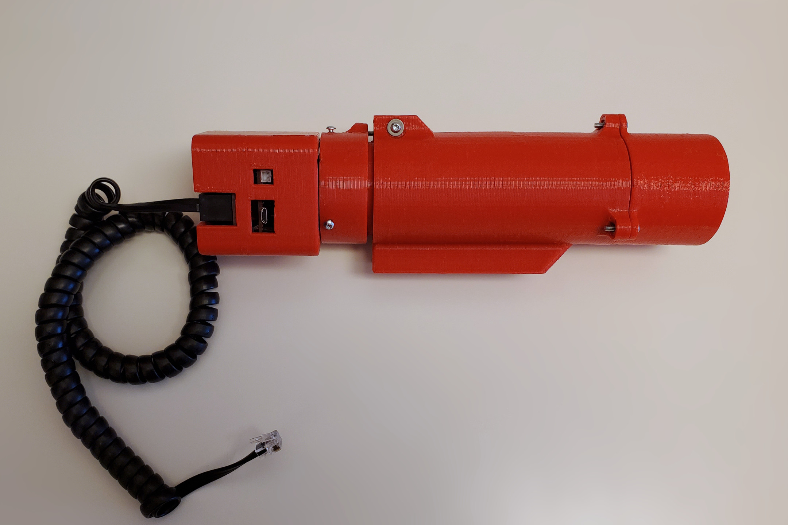
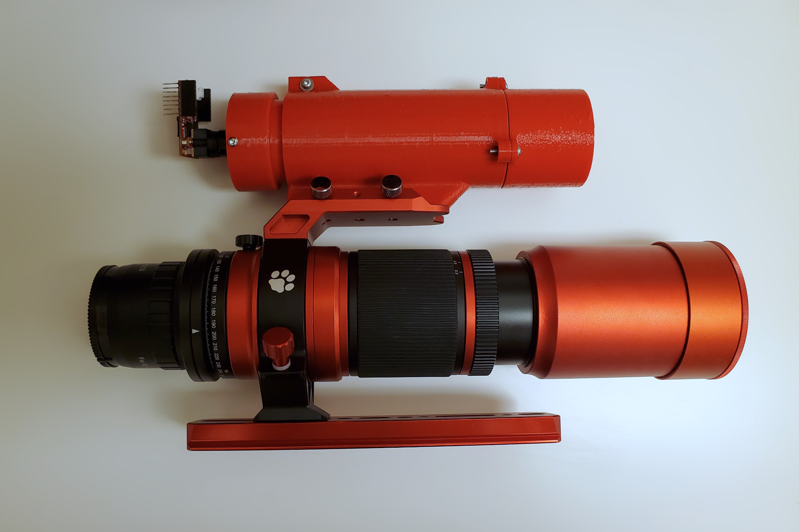
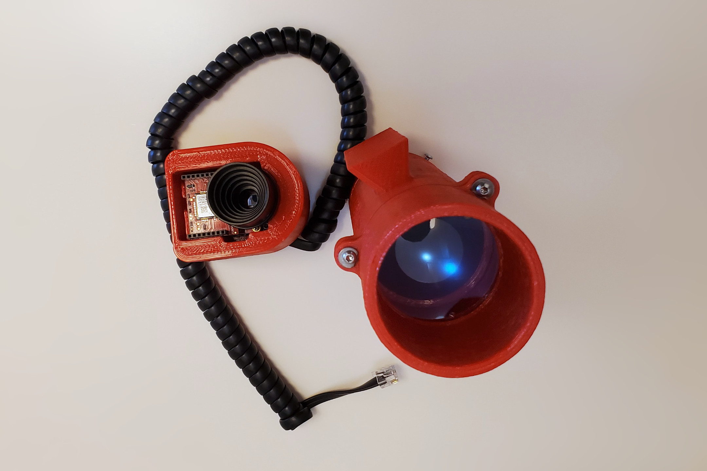
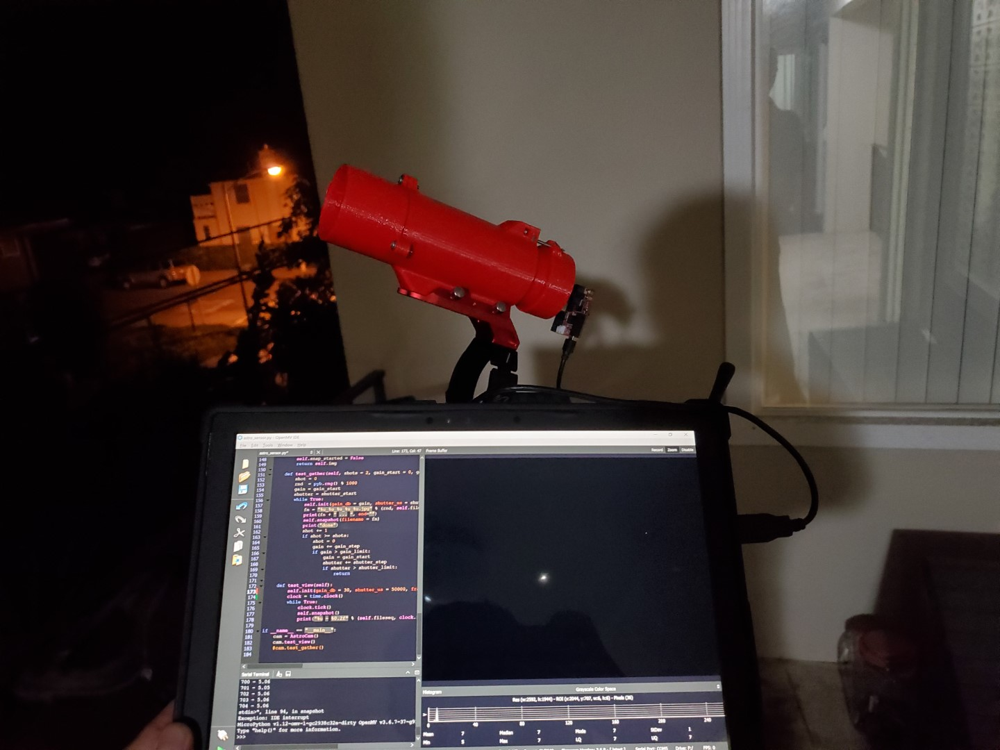

This project will eventually completely eliminate the need to use the PHD2 software.

After this is done, the next step is to add a declination motor to the Sky-Watcher Star Adventurer, and to give it extra load capacity. This will eliminate the need to own a fully computerized goto mount to take advantage of autoguidance.
