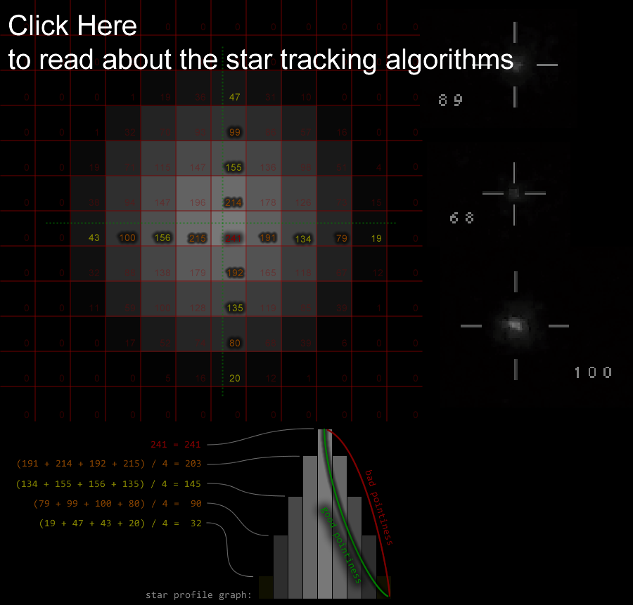
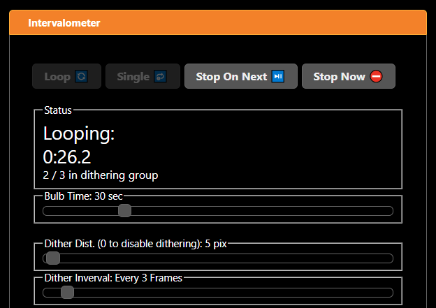
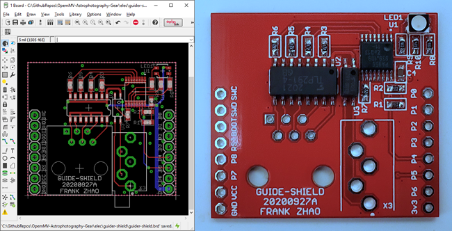
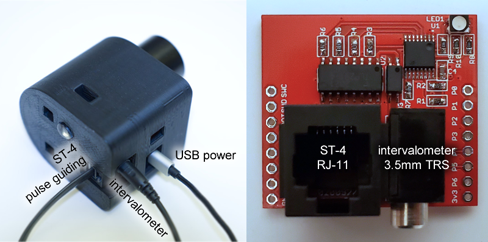
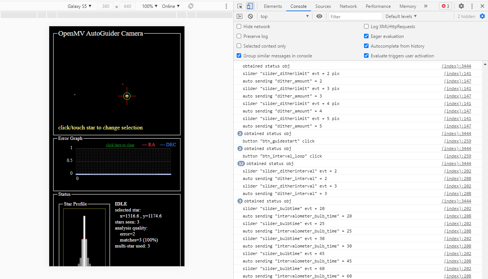
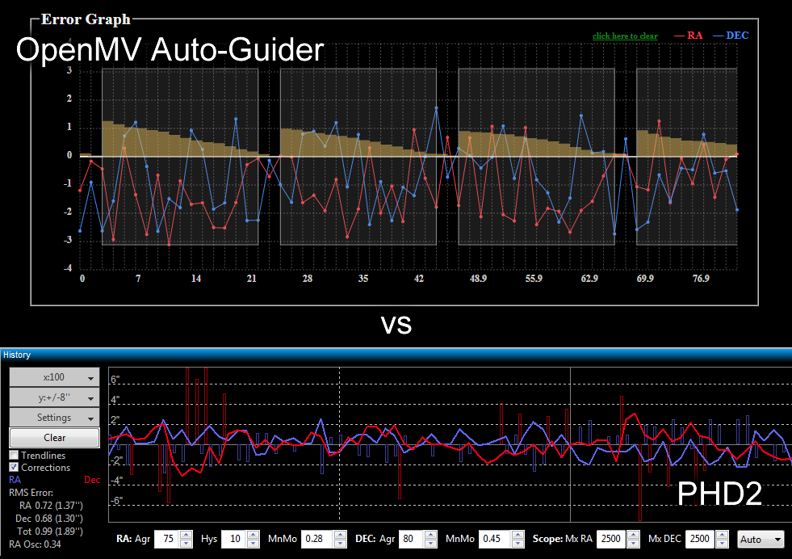

OpenMV Auto-Guider
==================

Auto-guiders are cameras that command a motorized equatorial telescope mount to track a particular star in the sky. This allows astrophotographers to take extremely long exposure photos, as the tracking will eliminate star-trailing caused by incorrect motion (mechanical imperfections of the gears) and error in polar-alignment.

Current popular auto-guider cameras are expensive and require a computer to run special software (such as PHD2). My project goal is to eliminate the need for a computer by using OpenMV instead, allowing for my gear to be more portable.

My OpenMV Auto-Guider uses OpenMV's sensor and image processing algorithms to track the stars. I've designed a special "shield" that allows it to send ST-4 signals to any motorized equatorial telescope mount that has a ST-4 input port. The user interface is built as a web interface, served by a WiFi shield and a web server running on the OpenMV.

The auto-guider is inserted into a small guide-scope. This is done by replacing the stock lens of the OpenMV with a M12-to-1.25inch adapter. The guide-scope I chose is a cheap Svbony SV106, which has a 50mm diameter objective lens with 190mm of focal length. The entire circuitry is protected by a 3D printed housing.

Star Tracking and Analysis
==========================

Intervalometer and Dithering
============================

Ditering is a technique that reduces apparant noise in stacked photographs. If a camera is extra noisy in one spot, or has a hot-pixel, and consecutive photos from that camera are stacked together, then the noise or hot-pixel will appear in the final stacked photograph. This is because the rejection algorithms in the stacking software can reject things that sporatically appear, but not things that are always there. In layman's terms, the algorithm thinks that things that are "always there" should be there.

Dithering means that for each photo, the camera is moved around slightly. This way, even though a bad pixel is staying at the same coordinate on the image, it does not stay at the same spot in the sky. This will make the stacking software reject the bad pixel. This also helps reduce patterned noise because it smears the noise around, while preserving signal details.

To be able to do dithering, an auto-guider is required as randomized dithering without tracking may lead the main telescope to go off-target. But the dithering movements must happen while the photo camera's shutter is closed, so the auto-guider needs to coordinate with the intervalometer somehow. The solution is to simply build the intervalometer signal output into the same circuit that generates the ST-4 pulse signals. A 3.5mm jack for an intervalometer output is placed beside the ST-4 output port on the special shield I designed.

The intervalometer also has basic capabilities, such as taking repeated long exposure photos on a loop. It can also take single photos for the purposes of testing exposure settings. The loop can be paused without ruining the currently running exposure.

Circuitry
=========

The special shield I designed uses a I2C port expander chip to add GPIOs to the OpenMV (which didn't have enough GPIOs for the job). The expander adds enough signals for the ST-4 signals, the intervalometer, and a RGB LED indicator. As the ST-4 signals require a bit of timing accuracy, the firmware to drive the I2C bus is written in the C back-end firmware to avoid function call overhead and the garbage collector of MicroPython.

All of these outputs are opto-isolated. This is a nice feature as all the equipment involved are very expensive, and it prevents massive ground-loops from being formed.

Web Interface
=============

The web interface is a HTML page served from the microSD card using a HTTP server implemented in MicroPython. There is a configuration file that is used by the WiFi chipset to know which WiFi access point to connect to (with login credentials), if it fails to connect to an existing access point, it will default to becoming its own adhoc access point. Out in the field, the user can use a smartphone to access the web interface, either by using a hotspot, or by using the adhoc access point.

The web interface uses Jquery and JQuery-UI to make the nice looking UI elements. The error graph is draw using [Chartist by gionkunz](http://gionkunz.github.io/chartist-js/). The toast messages are generated using [js-toast by mlcheng](https://github.com/mlcheng/js-toast).

The image from the camera is shown as a SVG, not the true image, due to the bandwidth constraints of the slow WiFi chipset. Star coordinates and properties are sent over to the JavaScript, and the SVG simply draws some circles. The circle's size, brightness, and color, are changed according to the properties of the star.

Live image streaming is still possible, for the purposes of adjusting guide-scope focus, but it halts all image processing. Each full resolution JPG is more than 2 megabytes (even after compression), which would take a second or two to transfer over WiFi. As the OpenMV is a single core processor, this can't happen on another thread, so there's simply no time left for processing if the image is being live-streamed.

Status, settings, and command data traveling between the server and the web browser uses WebSocket.

This architecture is extremely easy to debug while sitting at a desktop computer, thanks to the developer tools built into all modern web browsers. I can use the JavaScript debugger, console logs, network analyzer, and even simulate a smartphone screen.

Once the auto-guider is fully configured, calibrated, and running, the smartphone can be disconnected and the auto-guider will continue to operate throughout the night. If it encounters an unrecoverable error, it will rapidly flash the red LED.

The HTML page also features collapsible help text, to help the user understand each function and setting. There are also some handy calculators that can help determine the most optimal settings.

Comparison to Others
====================

A popular entry level guide camera is the ZWO ASI120MM.

 n theory, this means the ZWO camera is more sensitive to light but the OpenMV should have double the tracking accuracy. This sounds great but the additional risk is that a larger image takes more time to analyze, especially without a powerful processor. The ZWO camera may be easier to process but the OpenMV has a high-speed direct interface between the sensor and microcontroller, while the ZWO camera only has USB 2.0 transfer capability.

Some of the algorithms I implemented are inspired by the popular PHD2 auto-guiding software. Features from PHD2 that I've implemented:

 * single star tracking
 * multi-star tracking
 * dithering
 * calibration
 * direction lock-in
 * predictive filtering (but not PEC)
   * I implemented the filters as simple digital filters and PID controllers, while PHD2 uses more detailed history analysis

Notably, some features require more hardware or astrophotography experience that I currently lack:

 * Periodic Error Correction
 * automatic configuration (the guiding assistant)
 * ASCOM control over equatorial telescope mount
 * drift alignment

Also, my user interface is much more simple and mostly unit-less (I have a closed ecosystem, while PHD2 supports all possible cameras). PHD2 has a more detailed UI. However, my error graph implementation features tracking shutter status and accumulated errors.

There are other "standalone" auto-guiders on the market. The NexGuide or SynGuider only has 752 x 480 resolution at $300 (with poor user reviews). Better ones like StarAid or Lacerta costs well over $1000.

Development Difficulties
========================

Some of the algorithms run extremely slowly, and things written in MicroPython are extremely memory intensive. Any algorithm that had to run in O(n) time or worse was written into the C back-end firmware. The find_blob function is already written in C but the data structure that represented each blob was very heavy on memory, so that data structure had been lightened-up by removing useless attributes (e.g. convexity). Some sheldom-changed MicroPython scripts are pre-compiled into flash memory instead of being loaded into the interpreter at runtime.

Doing all this cut the processing time for each frame from 2 seconds down to less than 0.5 second, which is great since the frame rate is 1 frame-per-second.

The down-side is that the code becomes less accessible, and in-field code changes are no-longer possible.

Since writing code outdoors is difficult, especially in the winter months, a simulator was written to enable development at home. The simulator can analyze static image files and then randomly move the stars around to simulate movement.
