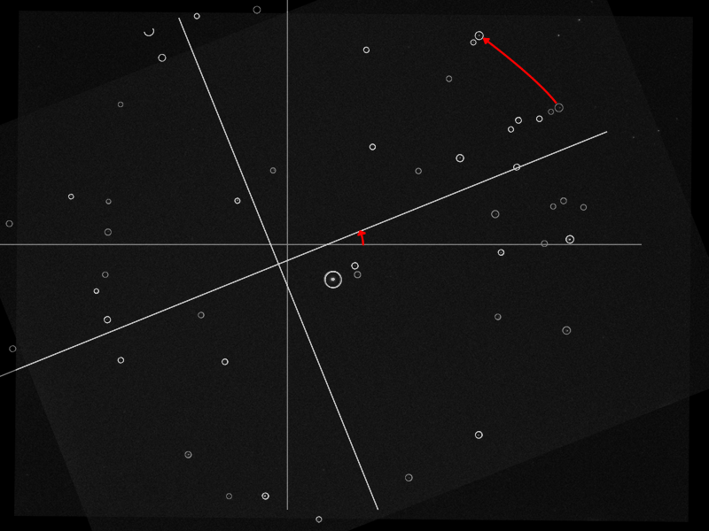
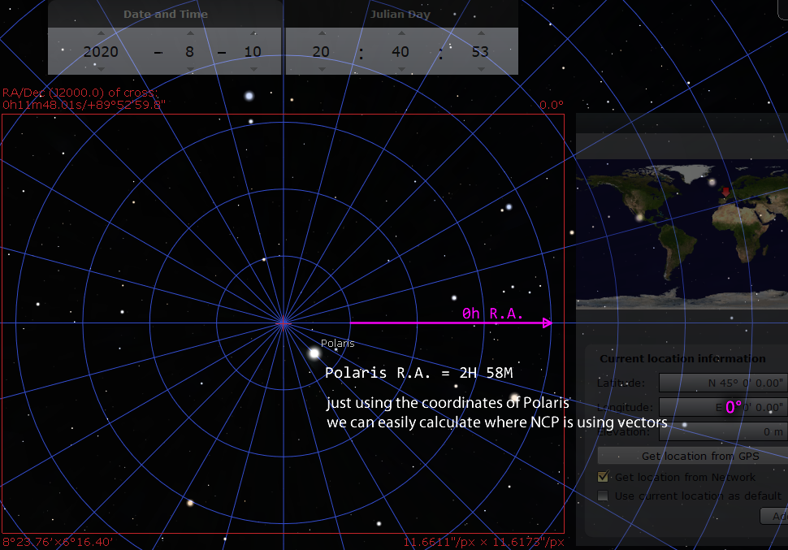
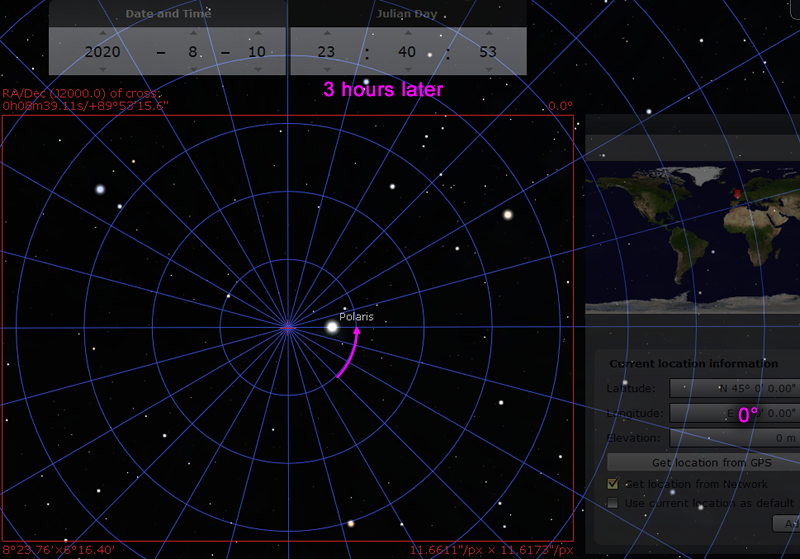
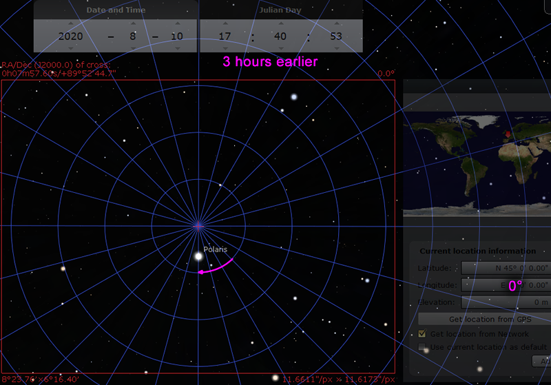
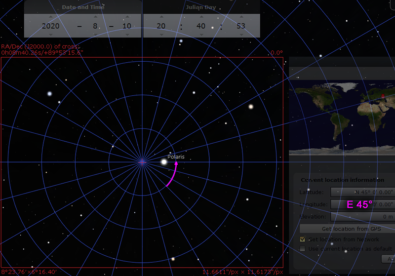
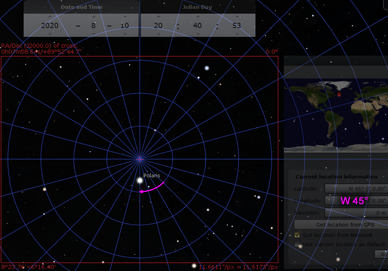
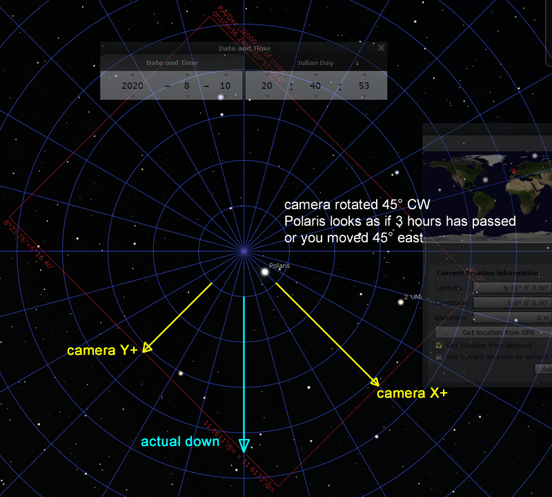
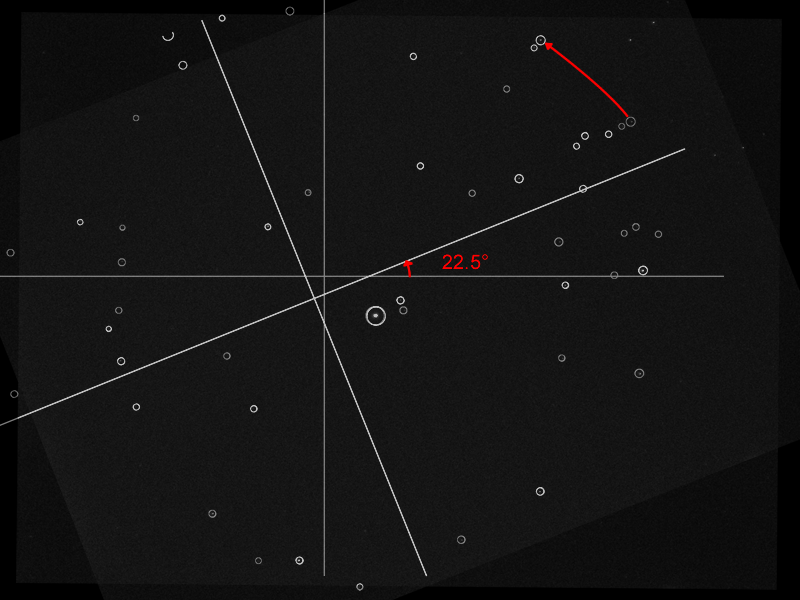
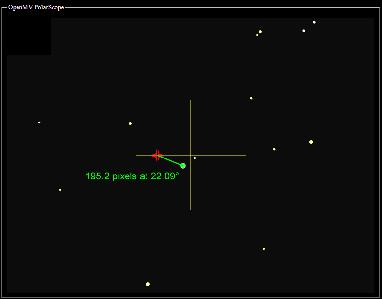

Calculations For Polaris
========================

The main Polaris-finding algorithm will find Polaris by looking at the stars around it. Knowing the angle of those stars referenced to Polaris is actually enough to calculate where the North Celestial Pole is. This works at any time and on any longitude.

The above is an illustration showing a real photo, with the stars identified by the matching algorithm. The algorithm can determine the rotation of the image using the location of the surrounding stars.

At this point, we do not need time or location for this device to work. But we want to add the feature to compensate for atmospheric distortion. For that to work, we need to know where the ground is. We cannot assume the camera is always right-side-up because the camera will be mounted on a rotating tracker.

To do this calculation, we do need to know the current time and location.

We need a reference time. I picked the 10th of August 2020, at exactly 20:40:53 UTC time. At this time, if you were standing at a longitude of 0° (Greenwich UK) looking at the North Celestial Pole, 0 hour of right-ascension is pointing exactly to the right.

That date and time makes it easy for a computer to perform accurate calculations. The standard MicroPython library uses 1st of January 2000 as the time reference, a.k.a. the epoch. All time data is stored as seconds-since-the-epoch. The sky rotates once around the Earth every sidereal day, which is not 24 hours, but rather exactly 86164.09054 seconds. One quark about calculating numbers on a computer is that operations involving a big number and a small number might become inaccurate. This is because the computer needs to use bits to store the whole part of the number first, and the bigger the number, the less bits are available to store the numbers after the decimal. The number of seconds since 10th-of-August-2020 will be much smaller than 20 years earlier, which will make the calculations slightly more accurate.

I have ran tests and have confirmed that with plain floating point calculations, it will be accurate even in the year 2040.

With 0H of R.A. pointing exactly to the right, it makes all of the geometry calculations much easier. We can just pretend it is a cartesian plane. Polaris has a R.A. of about 2H 58M, which is close to 3 hours, which is about 45° when converted. Notice that on the image, it is sitting about 45° from the horizontal.

Now we can think about what happens when time passes, and what happens when you move to a new location:

Now consider the case that the camera is rotated

(notice: camera's Y axis uses top-left corner as origin, so down is positive)

Let's do an example. Imagine if the camera saw this image on `August 31 2020 at 18:00:00 PST`, and the location is `W 122°`

The plate solver tells me that the angle is rotated 22.5° counterclockwise. If the star `HD 5914` is supposed to be `-10.6°` away from Polaris, but is detected at `-33.1°` instead, then the rotation returned be 22.5° counterclockwise. (the algorithm checks more than one star, the report would've been an average)

(I have a whole other page describing how the plate-solver works: [click here to read it](Polar-Scope-Algorithm))

On this day, Polaris has coordinates `R.A. 2H58m21.21s` and `Dec. +89°21'07.7"`. Convert R.A. to angle gives 44.59°. I can convert the declination to pixels directly, the scale is about 301.3 pixel-per-degree. The declination is 0.647861° away from the NCP. `301.3 * 0.647861 = 195.2` pixels. The angle from the NCP would be `44.59° - 22.5° = 22.09°` clockwise (clockwise because now positive Y is down).

Converting the date and time to UTC first yields `September 1 2020 01:00:00`. The number of seconds since `10th of August 2020 20:40:53 UTC` is 1971653 seconds. Each sidereal day is 86164.09054 seconds. Perform the division `1971653 / 86164.09054 = 22.8825371` rotations of the sky. Since we don't care about full rotations, we care about the 0.8825371 rotations that happened. `0.8825371 * 360° = 317.7°`, 317.7° "later" since the last full rotation.

(the actual code uses the `math.fmod()` function for this)

As for the location, it's west 122°, which is equivalent to "earlier". This means we can do `317.7° - 122° = 195.7°`

We can now say the image should be rotated 195.7° "later", counterclockwise, if the camera was right-side-up. But the image is only rotated 22.5° counterclockwise. `195.7° - 22.5° = 173.2°` , which is very close to 180°. We can say the camera is almost upside-down!

This kind of calculation is critical for compensating for atmospheric refraction

Obviously, to do this kind of compensation, you must know which way is up and which way is down! Remember, the camera is free to rotate by the user, you can't just assume camera orientation.

(info on how atmospheric refraction is calculated is written back in the [main page](Polar-Scope))

When I was working on this project, there was a lot of testing done to verify my mathematics. But during the development, California decided to go on fire so I couldn't actually do many outdoor tests. Testing was done in the following ways:

 * take photos of Polaris, and rotate the image
 * randomly generate future date, time, and location, then check expected rotation against Stellarium
 * add a time acceleration mode to see if things were rotating in the right direction
