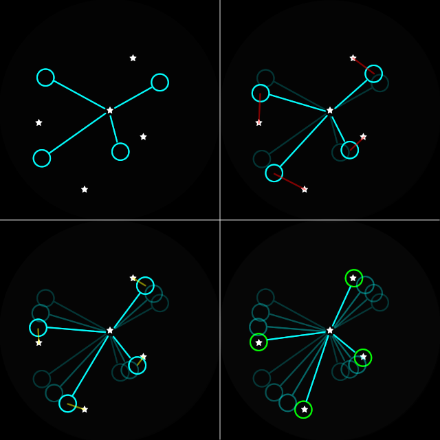
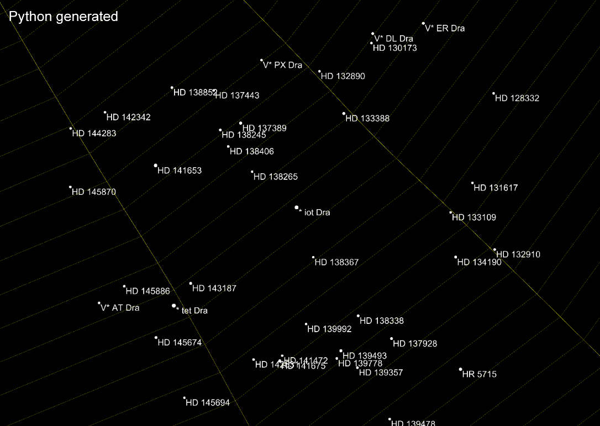
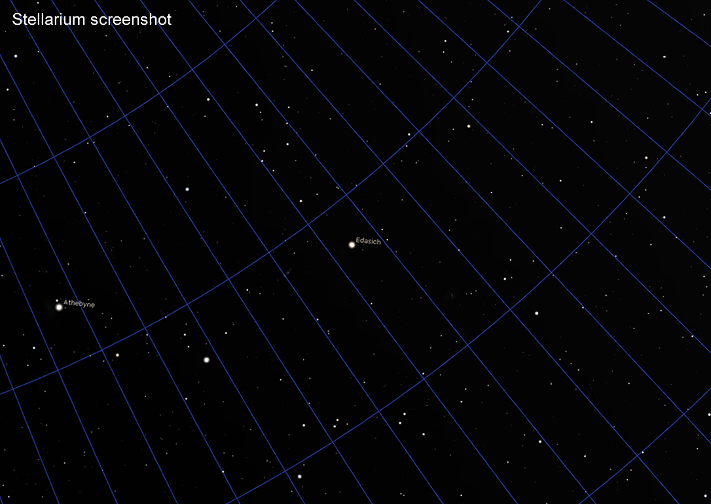
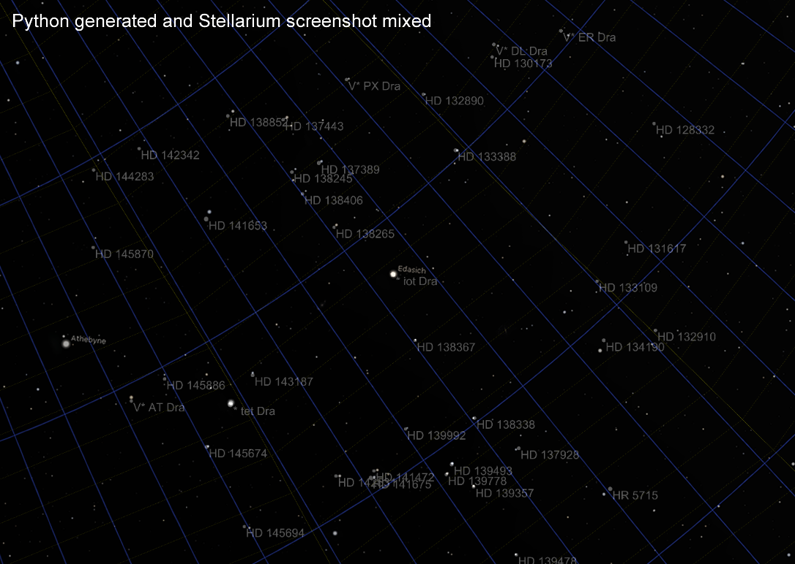

Extra Stars Plate Solving Algorithm
===================================

I wanted another feature: identify other stars that are not Polaris. This would help people if they get "lost". If people can identify what they are pointed at, they can use additional smartphone apps to help navigate towards Polaris.

The database needs to be compact (I explain later). The stars in the database are only the ones within 45° of Polaris, with a sufficient brightness. I expect the user to at least know roughly where North is and also capable of turning the latitude knob correctly before even turning on this camera.

The match algorithm is similar to the one used to identify Polaris. The database contains a set of vectors for each star, each vector representing the vector between the target star and a neighboring star. But unlike the other algorithm, instead of establishing a reference angle using the first neighboring star, this new algorithm simply checks all 360 possible angles. To visualize, the vectors are simply being spun until matches are made:

Possible pattern matches are scored by number of matched stars and the total error. The result with the lowest average error is shown to the user at the end as a sorted list. (lowest average error is the total summed error divided by the number of matches, so a higher number of matches causes a lower average error)

For a very dense image, getting a false-positive pattern match is very likely. Later I added the ability to penalize the score if a bright star is somewhere in the pattern's area but isn't expected. This lowered the probability of a false-positive result.

The entire routine will iterate through all 500 stars in the database so it's quite slow. So I made it only operate on one star that the user selects.

Generating the Database
=======================

For the stars very close to the NCP, the projection method is the same as the algorithm that identifies Polaris. The azimuthal equidistant projection.

For the stars with a lower declination, the distortion will cause too much error. To understand using an example, pretend 1° arc-distance is scaled as 100 camera pixels. To draw the equator using azimuthal equidistant projection, this would mean the radius of the circle will be 90° away, equal to 9000 camera pixels. Calculating the circumference of that circle, the diameter is 18000 pixels, so the circumference is 56548.7 pixels. What should this be? It should be 36000 pixels, the error is 57%!

Doing this again at about 80° declination, `90° - 80° = 10°` so the radius is 1000 pixels, diameter is 2000 pixels, circumference is 6283 pixels. The expected circumference should be equal to... `cos(80°) = 0.17365`, and then `36000 * 0.17365 = 6251` pixels! The difference being only about 32 pixels is awesome, that's only 0.5% of error. The star Polaris is usually about 28 pixels in diameter on the camera sensor.

The database is kind of split in two. The stars above 80° declination uses azimuthal equidistant projection. The rest of them uses... kind of a warped cylindrical projection, I don't know the name of it but I can explain it:

At the equator, if a 1° arc is 100 pixels, then 1° declination means 100 pixels in the Y axis, and 1° of right-ascension is also 100 pixels in the X axis. But if we move above the equator, to a declination of 60°, then 1° of declination is still 100 pixels in the Y axis, but 1° of right-ascension should now be 50 pixels in the X axis. This is because `cos(60°) = 0.5`

The database generator I wrote does this calculation for each of the stars and its neighbors, and it also generates some visualizations. For example `* iot Dra`:

Compare that against a screenshot from Stellarium (which is using stereographic projection)

Overlaying those two images on top of each other...

Uh oh, some of the stars are spot-on but some of them are really far apart. This will cause problems if the tolerance of the matching algorithm is set too tight. What's interesting is that the lines I drew to represent RA are not straight! This is a clue that the problem lies with the floating point precision numbers that are used to do the calculations. Remember that the celestial coordinates are given in degrees (or hours), minutes, and seconds with decimals. Converting that to a single degree number may cause some precision to be lost.

So I tried a few other things:
 * gnomonic projection
   * it gave the stars a "fish-eye" type of distortion, did not perform better
 * arbitrary precision numbers
   * it did not improve the precision
 * using Taylor series for trigonometry functions
   * it slowed things down enough that I couldn't complete the database generation

Real world testing showed that the database generated using the warped-cylinder projection is performing well enough. I've done a real world test where the average error was only 7 pixels, that's less than the width of some stars.

Other Technical Challenges
==========================

I tried using MicroPython to load the database and immediately ran out of memory due to the overwhelming amount of data required. So I decided to put this feature into the JavaScript instead, it would be more responsive, and a progress bar would not require additional HTTP requests.

This also meant the database had to be in ASCII, as JavaScript cannot load any binary files. I fit a database of about 2700 stars, 500 identifiable, into a single string in JavaScript. This used about 300kb more data and added more than a second of page loading time. If I exceed 5 seconds, a mobile browser could timeout.
