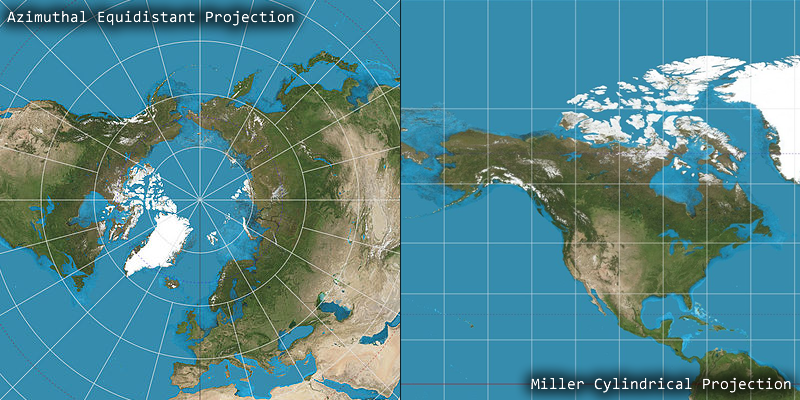
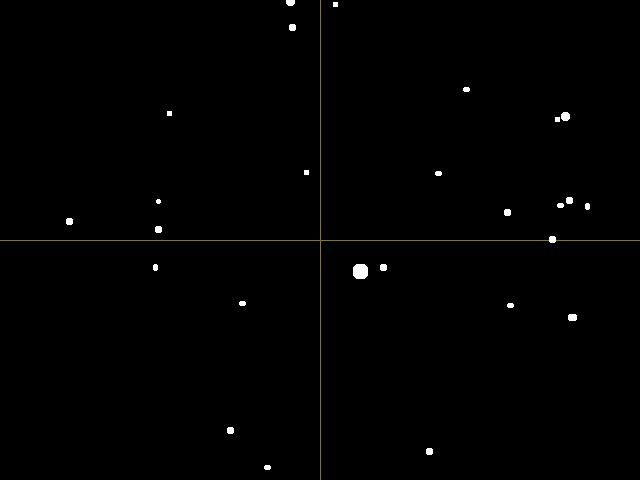
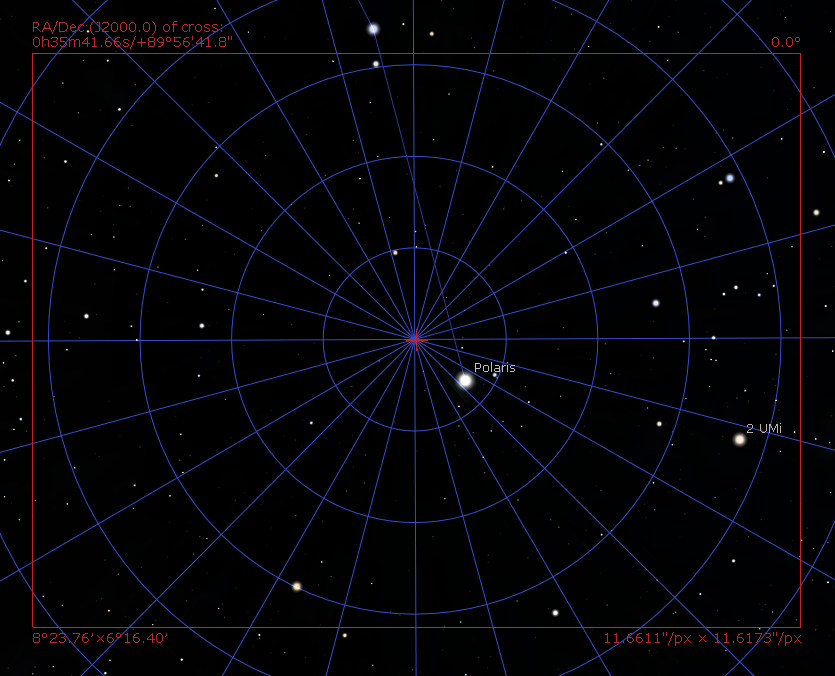
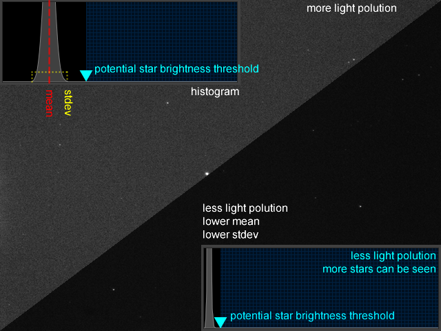
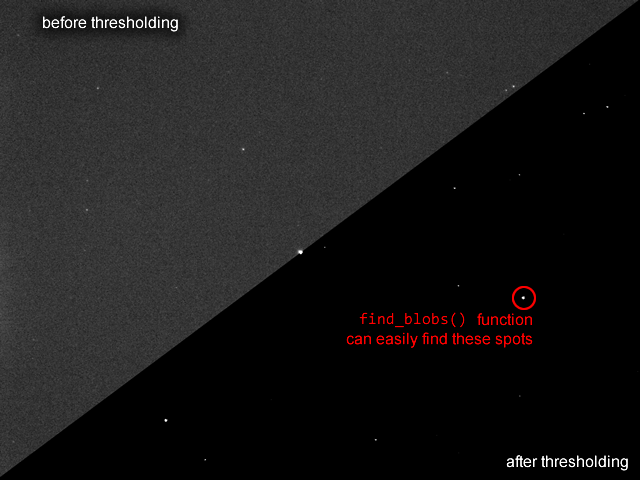
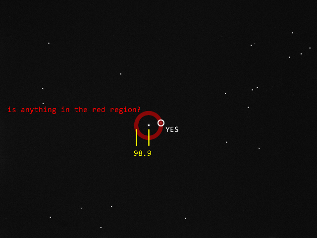
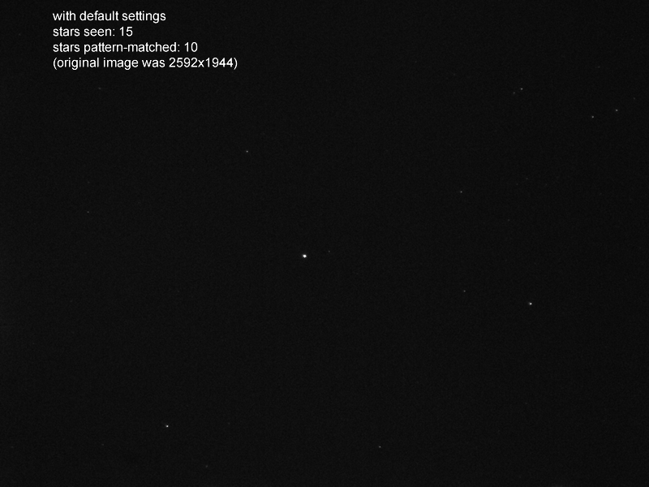
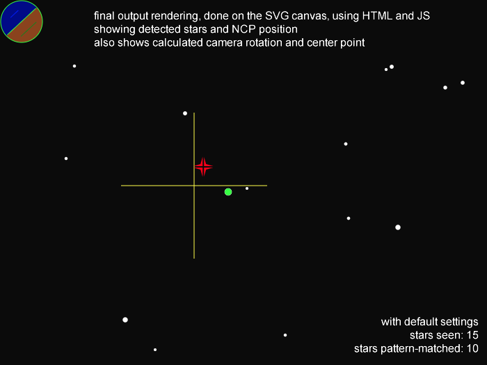

The Main Algorithm
==================

I will show you the plate solving algorithm for the OpenMV PolarScope project. The plate solver only has to identify one star: Polaris. It is optimized to take advantage of many aspects about the usage scenario:

 * Polaris is assumed to be in the view and assumed to be the brightest object in the view
 * The lens is fixed focus and the sensor is 5 megapixels, distances between stars are pre-calculated into per-pixel units
 * assume no distortion from the lens or the azimuthal equidistant projection

Getting started, I needed a database of stars. I used [SIMBAD](http://simbad.u-strasbg.fr/simbad/sim-fsam), which allowed me to search for stars that match a certain criteria. Knowing the field-of-view of my lens, about 6.8°, I chose to only include stars with a declination greater-or-equal to 86°. The second criteria is the star's brightness in magnitude, the lower the B magnitude number is, the brighter the star is. To choose the proper magnitude, I had to take some sample images using the camera first, to figure out what magnitude can actually become visible on the camera.

SIMBAD spits out a list of stars, with celestial coordinates of each star, where they were in the sky on Jan 1 2000.

    C.D.S.  -  SIMBAD4 rel 1.7  -  2020.07.30CEST05:59:57

    dec >= 86 & (Umag <= 10 | Bmag <= 10 | Vmag <= 10)
    -----------------------------------------------------

    Number of objects : 27

    # |     identifier       |typ|       coord1 (ICRS,J2000/2000)        |Mag B |
    --|----------------------|---|---------------------------------------|------|
    1 |V* V377 Cep           |dS*|23 24 20.71514 +86 25 04.0443          | 6.89 |
    2 |HD 221488             |PM*|23 27 43.5941302222 +86 33 31.866171777| 7.67 |
    3 |HD 224687             |*  |23 59 30.7341527695 +86 42 23.050914425| 6.80 |
    4 |HD 212710             |PM*|22 13 10.4452006189 +86 06 28.778095630| 5.233|
    5 |HD 212774             |*  |22 13 11.0373229288 +86 13 16.809077663| 7.78 |
    6 |V* V378 Cep           |El*|23 31 33.8652216084 +86 10 41.011330863| 7.26 |
    7 |* 2 UMi               |PM*|01 08 44.8800522 +86 15 25.523975      | 5.459|
    8 |HD 174878             |V* |18 15 28.6493393792 +86 39 27.887337238| 8.111|
    9 |HD 221525             |PM*|23 27 00.9133817219 +87 18 27.030422836| 5.790|
    10|HD 213126             |*  |22 03 13.6522522658 +88 04 23.020182755| 7.55 |
    11|HD 203836             |*  |20 57 22.3397609433 +87 01 57.595132296| 7.520|
    12|HD 6319               |PM*|01 16 13.2055903375 +87 08 43.784645231| 7.301|
    13|HD 5914               |PM*|01 33 50.6910391944 +89 00 56.301403593| 6.560|
    14|* alf UMi             |cC*|02 31 49.09456 +89 15 50.7923          | 2.62 |
    15|HD 22701              |PM*|04 10 01.6311986916 +86 37 34.102860939| 6.220|
    16|* del UMi             |PM*|17 32 12.9967087 +86 35 11.258377      | 4.367|
    17|* 24 UMi              |PM*|17 30 47.5850953627 +86 58 04.964051992| 5.981|
    18|* lam UMi             |LP*|17 16 56.4107068491 +89 02 15.734282923| 7.95 |
    19|V* UY UMi             |gD*|12 15 20.2704171661 +87 42 00.427589080| 6.590|
    20|HD 114282             |*  |12 53 56.0887926484 +87 38 53.944435832| 8.910|
    21|HD 135294             |*  |14 40 18.3209264136 +87 12 53.171015592| 8.370|
    22|HD 66368              |** |09 21 48.55505 +88 34 13.2365          | 7.265|
    23|HD 96870              |*  |11 21 47.8279843177 +87 38 18.467013086| 7.48 |
    24|V* OV Cep             |LP*|07 40 30.4985248892 +87 01 12.383485125| 6.70 |
    25|HD 42855              |PM*|06 51 47.2866520811 +86 41 03.624955885| 7.772|
    26|HD 107113             |PM*|12 16 51.3385999930 +86 26 08.951212292| 6.76 |
    27|TYC 4643-155-1        |*  |09 21 48.596 +88 34 13.21              | 7.28 |

I use a Python to parse this table out, and project the coordinates using azimuthal equidistant projection.

To understand what a azimuthal equidistant projection is, compare it against other forms of projection you might be familiar with:

I might be using fancy words, but in reality, it just means I'm using declination to calculate the distance between the middle of the image to a star by just one multiplication. I'm essentially turning right-ascension and declination into vectors quickly. Using this projection makes the mathematics very simple, as I can ignore distortion.

Here's the visualization of what my database parser sees:

The Stellarium software allows astrophotographers to input their camera specifications and show a preview of what the camera would see. You can also tell it to change between different projection methods. It showed me that my projection method is valid and my assumption of negligible distortion is also valid.

Neither the parser nor Stellarium would be able to generate a true preview of what the camera sensor sees. The pixel distances between each star is calibrated using pictures I actually took with the camera. Using Polaris as the reference point, the same Python script calculates the vector from Polaris to each star. The table is sorted from closest to fartest. The first number is the distance (vector magnitude) in pixel units, the second number is the angle of the vector.

    "HD 5914",         98.867180,  -10.647256,
    "* lam UMi",      479.008301, -118.529852,
    "HD 66368",       524.994808,  164.780381,
    "HD 213126",      534.725064,  -51.636087,
    "HD 6319",        654.323145,   12.759174,
    "HD 221525",      676.906523,  -21.909059,
    "HD 22701",       820.441622,   68.948647,
    "HD 224687",      829.461143,   -9.602170,
    "V* OV Cep",      875.677409,  129.407251,
    "HD 96870",       876.265358, -178.807660,
    "V* UY UMi",      884.833301, -168.092577,
    "HD 203836",      896.804216,  -59.867339,
    "HD 221488",      897.533794,  -18.299156,
    "HD 114282",      914.532044, -160.757620,
    "* 2 UMi",        924.487512,   12.313035,
    "HD 42855",       927.519046,  115.447469,
    "V* V377 Cep",    942.226371,  -18.793331,
    "V* V378 Cep",   1007.975111,  -16.059071,
    "HD 135294",     1060.463568, -140.366796,
    "HD 212774",     1063.289980,  -37.557174,
    "* 24 UMi",      1082.153394, -105.587018,
    "HD 212710",     1096.976152,  -37.222721,
    "HD 174878",     1146.140083,  -95.341928,
    "* del UMi",     1195.457555, -104.488215,
    "HD 107113",     1264.471354, -170.201903,

When the camera takes a new picture, the code needs to find the stars in the picture first. It needs to somehow separate the stars from the background. The image is analyzed first, to see how bright the sky is overall. This is done with the `get_histogram()` and `get_statistics()` functions of OpenMV. The result is mainly is affected by the light pollution and the camera settings. With that analysis, it can figure out the threshold brightness of stars. (the threshold is also user customizable)

To find the position of each spot, the OpenMV function `find_blobs()` is used. Internally, `find_blobs()` will perform a threshold filter on the image first before the search algorithm to speed things up a bit.

Then it gathers a list of blobs, with its coordinates and size. Using that information, my own code also calculates a brightness of each blob using a summation of the pixel brightness inside each blob.

Since we assume that Polaris is in the view, and it will always be the brightest star, we choose the brightest blob as the reference point. From the reference point, we look for the star named "HD 5914", which is the first in the table. It should be about 98.9 pixels away from Polaris, and we don't know the angle yet, so we just care about distance for this first entry.

From that match, we can establish a reference angle. The next star is "* lam UMi", with a distance of 479 and vector angle of -118.5°. "HD 5914" has a vector angle of -10.6°, so the difference is 107.9°. Knowing this new vector, we check if "* lam UMi" exists.

The algorithm will continue doing this until it either checks all the stars or has checked the entire database. Each correct match counts as a score point. A minimum number of points is required for the solution to be considered valid.

Here's how well it works in reality:

If a star is not where the database says it should be, then it is skipped. Skipping too many means the score will be too low.

The database is sorted by distance to Polaris, and the list of visible stars being checked is also sorted by distance to Polaris. This means that once a match is made, the next match cannot be something closer. However, this can cause a problem. Look at "HD 203836" and "HD 221488", the distance value is different by only about 1 pixel. This could be slight blurriness or lens distortion could cause a failed match. For this reason, the algorithm will ignore "HD 221488".

Since this algorithm simply uses a whitelist of stars, it is more susceptible to false-positives, especially if more stars are seen. To address this, when the score is tallied up, the algorithm does one final check for "mystery stars" to avoid false-positives. It looks for any stars that are closer than the farthest matched star, and brighter than the dimmest star that had a match. Any such star should be in the database, but if it isn't, then it's considered a mystery star. Since it shouldn't be there, it will be counted as a penalty against the total score. Any hot-pixels are accounted for during this final process. This technique is only valid if we assume that the original SIMBAD database is comprehensive enough. (satellites, meteors, and airplanes will cause a penalty, but this is a momentary problem)

The matching does have some tolerance to account for blurriness and lens distortion, but in the end, the true detected distances and angles are averaged to calibrate the calculation of the North Celestial Pole. As the NCP and Polaris will be very close to the center of the image, the lens distortion isn't something to be worried about anyways, as through the center of any lens, the path of the light should be perfectly straight. It's the edges that experience the most distortion, if there was any.

This whole algorithm for Polaris is different from the other more generalized plate solving algorithm implemented later. The difference is that the more generalized algorithm does not establish a reference angle with the first star it matches, instead, it simply loops through 360 different angles and see which angle results in the most matches. This is slower but the slower algorithm runs on the smartphone (as JavaScript) instead of OpenMV (as MicroPython) so I don't really care, it doesn't really ruin the user experience.

This Polaris specific algorithm only works if the stars "HD 14369" and "HD 1687" are not visible, otherwise the algorithm needs to become recursive and check three different reference angles instead of just one. Those two stars are quite dim and my camera never sees them even at aggressive settings, which is why testing the camera before writing the code was so important. The generalized algorithm does not have this problem as it checks all 360 angles.
