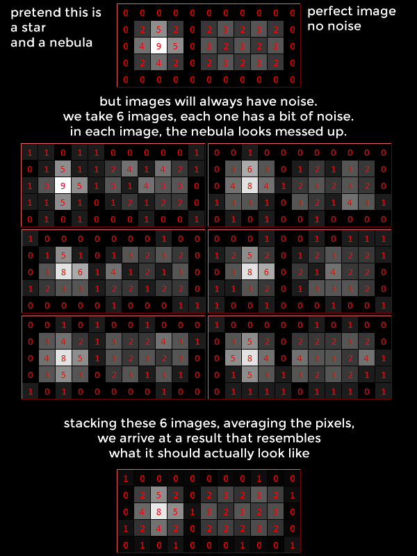
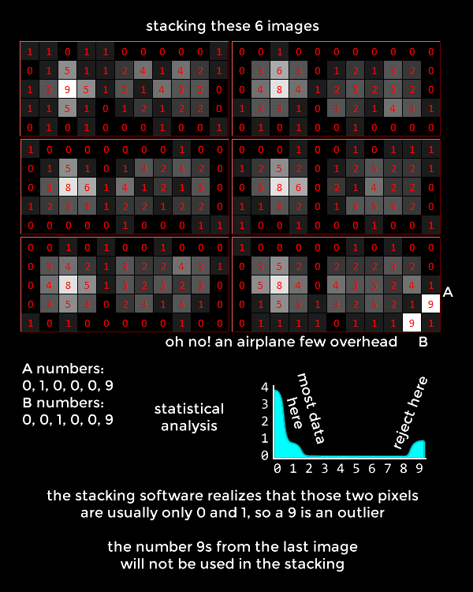
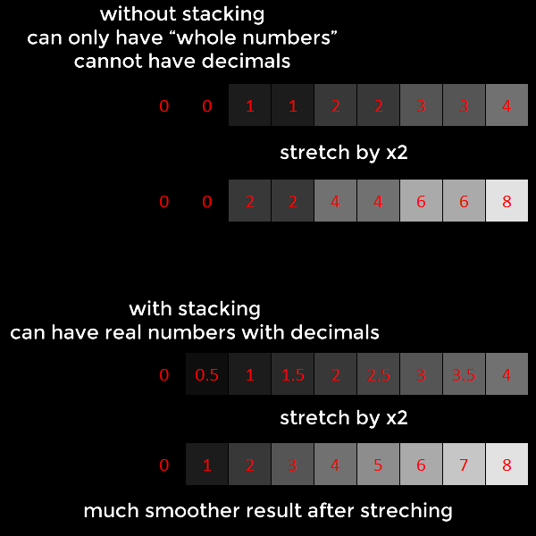
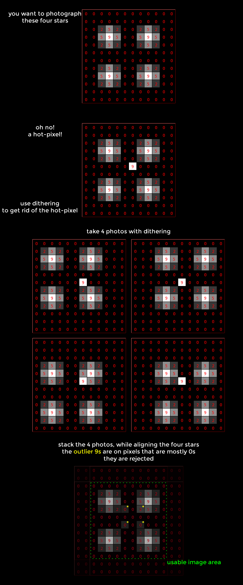

This page will teach the basics of how stacking images help in astrophotography, and how to remove unwanted artifacts or noise from stacked images (with dithering and sigma rejection)

## Stacking

Astrophotography is about taking photographs of things in the night sky. The stars are bright, but the other pretty things are actually very dark, so dark that the human eye can't see them because our eyes simply can't collect enough photons from those pretty things.

The solution is to collect photons over a very long period of time, to make something invisible to us visible to a computer. That's why astrophotographers take long exposure photographs, to collect as many photons as they can.

We want those photons to land at the right spot on our camera sensor. When they land at the wrong spot, the photo becomes blurry, or the star looks like it moved. Each pixel of the sensor also has a maximum limit of photons it can collect before the electrons that the photons converts into moves outside of the pixel. Because of these two reasons, we want the long exposures to be long, but they also can't be infinitely long.

So how do you collect as many photons as possible but still have a limit on time? Easy, you take many photographs, and **stack** them together. One of the purposes of stacking is to increase dynamic range, which makes dark objects suddenly visible.

Stacking also helps you see details in the dark objects. You can only see details when your brain can affirmatively say that it's not actually just noise. Stacking helps increase the signal-to-noise (S.N.R.) of a image.

With the statistical analysis involved in the stacking process, stacking software can also remove unwanted objects like airplanes, satellites, and meteors, from your astrophotographs. It does this by finding outlier pixels

## Reducing Noise

## Sigma Rejection

## Dynamic Range and Stretching

Most images you see on your computers use 8 bits per colour. This means each colour of each pixel can be a number between 0 to 255. For simplicity of discussion, pretend everything is black and white, 0 is pure black and 255 is pure white.

HDR monitors and TVs exist now that can show more than 8 bits of colour, but since most web services that host images still hosts JPG files, we'll assume that when your photo is being shown to somebody, it will be in a 8 bit file format.

Modern cameras, even the cheapest ones, have sensors that can record files that use 12 bits instead, so it can record numbers between 0 and 4095. The best amature astrophotography cameras can record 16 bit files, with numbers between 0 and 65535.

Imagine you are photographing a nebula using a 12 bit camera. It's so dark that the nebula is only recorded as a number 1, and black sky is 0. When you upload your photo, since you have to convert the file to a 8 bit JPG file, that 1 needs to be divided by 16. 1 divided by 16 is 0.0625 which gets saved as a 0 in your JPG file. Your audience cannot see the nebula you are trying to show.

You might think, "why not just make the image brighter with my editor software? just multiply everything by 16 before converting the file". There are a few problems with this solution:

 * other things in the photo will start to look bad, like stars, stars will turn into giant white blobs if you did this because you are multiplying the faint glow around the star
 * noise in the photo will get multiplied by 16

The solution to this is two parts:

 * Stacking software uses a file format with unlimited number of bits, called a FITS file (Flexible Image Transport System). This allows for stacked images that do not lose any data at all.
 * Using a technique called *stretching* to edit the image. We'll focus a bit on this technique.

In the most simple sense, *stretching* an astrophotograph is to bring out the darker details by only brightening the darker parts but leaving the brighter parts alone. It's like saying "make pixels that are 0 to 5 span from 0 to 10 instead", which kind of explains why it's called *stretching*. In a photo editor, this can be done with a combination of the *curves* adjustment and *levels* adjustment. However, some dedicated astrophotography software have a feature called *autostretch*, which is basically a curves adjustment that's calculated to make the perfect astrophotograph for you.

Stretching works better when the file format has more bits, and the input is from a stack of photographs, hence why the FITS file format is good for astrophotography. To understand why, pretend that having more bits is more like having pixel values with decimal places instead of just whole numbers. Remember that without stacking, you can't actually have decimal places.

## Dithering

Ditering is a technique that reduces apparant noise in stacked photographs. If a camera is extra noisy in one spot, or has a hot-pixel, and consecutive photos from that camera are stacked together, then the noise or hot-pixel will appear in the final stacked photograph. This is because the rejection algorithms in the stacking software can reject things that sporatically appear, but not things that are always there. In layman's terms, the algorithm thinks that things that are "always there" should be there.

Dithering means that for each photo, the camera is moved around slightly. This way, even though a bad pixel is staying at the same coordinate on the image, it does not stay at the same spot in the sky. This will make the stacking software reject the bad pixel. This also helps reduce patterned noise because it smears the noise around, while preserving signal details.

